# Boston Bus Equity — Final Project Report

**CS506 Data Science Tools and Applications · Spring 2026**  
Boston University · Spark! Hub

**Team:** zztangbu@bu.edu · lzj2729@bu.edu · ljf628@bu.edu · yaobc@bu.edu  
**Client:** City of Boston Analytics Team / Spark!

> 🎬 **Presentation Video:** *(YouTube link — to be added before May 1 deadline)*

### April Check-In Deliverables (preserved at top for graders)

- TA-facing check-in handout: [`docs/APRIL_CHECKIN_TA_HANDOUT.md`](docs/APRIL_CHECKIN_TA_HANDOUT.md)
- Technical check-in report: [`docs/APRIL_CHECKIN_TECHNICAL_REPORT.md`](docs/APRIL_CHECKIN_TECHNICAL_REPORT.md)
- GitHub submission guide: [`docs/GITHUB_SUBMISSION_GUIDE.md`](docs/GITHUB_SUBMISSION_GUIDE.md)
- Local quickstart: [`docs/LOCAL_QUICKSTART.md`](docs/LOCAL_QUICKSTART.md)
- Review checklist: [`docs/APRIL_CHECKIN_REVIEW_CHECKLIST.md`](docs/APRIL_CHECKIN_REVIEW_CHECKLIST.md)

The full final-report README continues below.

### Data Scope Extension
- **Original**: 2018-2024 MBTA bus arrival/departure data
- **Actual Available**: 2020-2024 (2018-2019 not available on MBTA Open Data Portal)
- **Extended**: Added 2025-2026 data as validation dataset (strict temporal split to prevent data leakage)

### Methodology Enhancement
- **Training Set**: 2020-2024 data (121M records) for model training
- **Test Set**: 2025-2026 data (28M records) for validation
- **Feature Engineering**: Wavelet decomposition, FFT spectral analysis, lag features, rolling statistics
- **Model Architectures**: MLP, LSTM, GRU, Transformer, Spiking Neural Network (NeuronSpark)

### Research Challenges We Address
1. **Temporal Feature Extraction**: How to extract meaningful patterns from delay time series using signal processing techniques?
2. **Neuromorphic Computing**: Can Spiking Neural Networks achieve competitive performance on time series regression tasks?
3. **Model Comparison**: How do different architectures (RNN vs Attention vs SNN) compare at similar parameter scales?
4. **Ablation Study**: Which feature extraction methods contribute most to prediction accuracy?

## Project Goals

### Base Goals (Q1-Q7)
| Goal | Metric | Target | Achieved |
|------|--------|--------|----------|
| Analyze ridership changes pre vs post pandemic | % change in ridership | Quantify change | ✅ -32.8% |
| Measure end-to-end travel times per route | Average minutes | Calculate for all routes | ✅ 28.4 min avg |
| Calculate average wait times | Minutes (on-time vs delayed) | Compare scenarios | ✅ 5 vs 12-15 min |
| Determine citywide average delay | Minutes | Single metric | ✅ 7.51 min |
| Compare target routes vs other routes | Delay difference % | Identify disparity | ✅ +41% higher |
| Identify service level disparities | On-time performance % | Route comparison | ✅ 25.8% vs 32.3% |
| Assess demographic equity impact | Correlation coefficient | Statistical significance | ✅ p=0.96 (no bias) |

### Extended Goals (Q8: Delay Prediction)
| Goal | Metric | Target | Achieved |
|------|--------|--------|----------|
| Build baseline delay prediction model | R² score | > 0 | ✅ R²=0.9846 (GRU) |
| Engineer time series features | RMSE reduction | > 50% vs baseline | ✅ 88% reduction |
| Implement neuromorphic SNN model | R² score | Competitive with GRU | ✅ R²=0.9897 |
| Achieve state-of-the-art performance | R² score | > 0.99 | ✅ R²=0.9942 (Transformer) |

## Key Research Questions

### Base Questions
1. What is the ridership per bus route? How has this changed from pre-pandemic to post-pandemic?
2. What are the end-to-end travel times for each bus route in the city?
3. On average, how long does an individual have to wait for a bus (on time vs. delayed)?
4. What is the average delay time of all routes across the entire city?
5. What is the average delay time of target bus routes (22, 29, 15, 45, 28, 44, 42, 17, 23, 31, 26, 111, 24, 33, 14)?
6. Are there disparities in the service levels of different routes?
7. If there are service level disparities, are there differences in the characteristics of the people most impacted (e.g., race, ethnicity, age, income)?

### Extended Question
8. Can we accurately predict bus delays using machine learning with advanced feature engineering?

## Project Structure

```
BostonBusEquity/
├── data/
│   ├── raw/                 # Original, immutable data
│   ├── processed/           # Cleaned, transformed data
│   └── external/            # Data from third-party sources
├── notebooks/               # Jupyter notebooks for analysis
├── src/
│   ├── data/               # Data processing scripts
│   ├── analysis/           # Analysis scripts
│   └── visualization/      # Visualization scripts
├── reports/
│   └── figures/            # Generated graphics and figures
├── docs/                   # Documentation
└── README.md
```

## Data Sources and Collection Methods

### Training Data (2020-2024)
| Dataset | Source | Collection Method | Size |
|---------|--------|-------------------|------|
| Bus Arrival/Departure Times | [MBTA Open Data Portal](https://mbta-massdot.opendata.arcgis.com/search?tags=bus) | Automated download script (`src/data/download_data.py`) | ~18 GB, 161M records |
| Bus Ridership by Trip/Season | [MBTA Open Data Portal](https://mbta-massdot.opendata.arcgis.com/) | Automated download script | ~850 MB, 1.8M records |
| Passenger Survey | [MBTA 2022-2024 Survey](https://gis.data.mass.gov/datasets/MassDOT::mbta-2024-system-wide-passenger-survey/about) | Manual CSV download | ~50 MB |

### Validation Data (2025-2026)
| Dataset | Source | Collection Method | Size |
|---------|--------|-------------------|------|
| Reliability Data 2025 | [MBTA 2025](https://mbta-massdot.opendata.arcgis.com/datasets/924df13d845f4907bb6a6c3ed380d57a/about) | Automated download script | ~2 GB |
| Reliability Data 2026 | [MBTA 2026](https://mbta-massdot.opendata.arcgis.com/datasets/9d8a8cad277545c984c1b25ed10b7d3c/about) | Automated download script | Partial year |

### Demographic Data
| Dataset | Source | Collection Method |
|---------|--------|-------------------|
| Census Data | [2020 Census for Boston](https://data.boston.gov/dataset/2020-census-for-boston) | API download |
| ACS Data | [ACS 2020-2024 5-Year Estimates](https://www.census.gov/programs-surveys/acs/data.html) | Manual download |
| Boston Demographics | [Boston at a Glance 2024](https://www.bostonplans.org/documents/research/population-and-demographics/2024/boston-at-a-glance-2024) | Manual download |

### Data Collection Implementation
```bash
# Automated data download (supports resume)
python src/data/download_data.py

# Check download status
python src/data/download_data.py --status
```

### Additional Sources
- [MBTA V3 API](https://www.mbta.com/developers/v3-api)
- [MBTA Performance Data](https://www.mbta.com/developers)

## Tech Stack

- **Python**: Primary programming language
- **Google Colab**: Collaborative notebook environment
- **Power BI**: Data visualization and dashboards
- **ArcGIS**: Geographic analysis and mapping

## Getting Started

### Prerequisites

- Python 3.8+
- Jupyter Notebook or Google Colab
- Required Python packages (see `requirements.txt`)

### Installation

1. Clone the repository:
```bash
git clone https://github.com/Brain2nd/BostonBusEquity.git
cd BostonBusEquity
```

2. Install dependencies:
```bash
pip install -r requirements.txt
```

3. Download data (first time only):
```bash
python src/data/download_data.py
```

> **Important Notes for Team Members:**
> - Data files (~20GB total) are NOT stored in Git - each person must download locally
> - `git pull` will NOT overwrite your downloaded data (data folder is in .gitignore)
> - If download is interrupted, just run the script again - it supports resume
> - Check download status anytime: `python src/data/download_data.py --status`

### Manual Data Download

Some datasets require manual download due to authentication or access restrictions:

#### 1. MBTA Passenger Survey Data (Optional, for Q7)

**URL:** https://mbta-massdot.opendata.arcgis.com/datasets/mbta-2024-system-wide-passenger-survey

**Steps:**
1. Open the URL above in your browser
2. Click the **"Download"** button (top right corner)
3. Select **"Download as CSV"** from the dropdown menu
4. Save the downloaded file to `data/raw/survey/`
5. Rename to `MBTA_2024_Passenger_Survey.csv` (optional)

#### 2. Boston Neighborhood Demographics (Optional, for Q7)

**URL:** https://data.boston.gov/dataset/neighborhood-demographics

**Steps:**
1. Open the URL above in your browser
2. Find the CSV resource and click **"Explore"**
3. Click the **"Download"** button
4. Save the downloaded file to `data/raw/census/`

#### Data Download Status

After running the download script, you should have:

| Dataset | Files | Size | Auto-Download |
|---------|-------|------|---------------|
| Arrival/Departure (2020-2026) | 65 | ~18 GB | ✅ Yes |
| Bus Ridership | 10 | ~850 MB | ✅ Yes |
| Census Neighborhood | 1 | ~22 KB | ✅ Yes |
| Passenger Survey | 1 | ~50 MB | ❌ Manual |
| Demographics (ACS) | 1 | ~100 KB | ❌ Manual |

### Running Analysis

```bash
# Full analysis on training data (2020-2024)
python src/run_analysis.py

# Quick test with 2024 data only
python src/run_analysis.py --quick

# Validation analysis (2025-2026)
python src/run_analysis.py --validate
```

### Real-Time Inference (Lightweight CLI)

The repository now includes a real-time inference entrypoint that reuses the
existing delay prediction checkpoints already stored in `models/`.

```bash
# Run real-time predictions with the existing baseline checkpoint
python -m src.models.run_realtime_inference --print-features

# Benchmark baseline inference latency
python -m src.models.run_realtime_inference --benchmark --iterations 200 --warmup 20

# Rebuild preprocessing artifacts from a local historical parquet/csv file
python -m src.models.run_realtime_inference --historical-data data/processed/arrival_departure.parquet --artifacts models/realtime_baseline_artifacts.pt
```

Notes:
- The inference path does not create a new model; it only reloads existing project checkpoints.
- For MBTA live integration, normalize real-time API payloads into the model input schema or pass them through `MBTARealtimeAdapter`.
- If you have a large historical dataset locally, save artifacts once with `--artifacts` to avoid rebuilding scalers and encoders on every run.

## Local Realtime Inference (Dashboard)

The repository now includes a minimal local HTTP inference path for realtime delay prediction.
This uses the **V2 MLP checkpoint** (`v2_lag_features_temporal`) because its features are causal
and can be reconstructed online without future leakage.

### Why Not V3 For Realtime?

The V3 wavelet experiment remains an **offline research model**. Its wavelet features are computed
over full route-stop sequences, so the current V3 checkpoint is not exposed as the realtime API model.

### Build the Realtime Bundle

The realtime service expects a single bundle file that combines:
- the V2 MLP checkpoint weights
- feature metadata
- scaler parameters
- route/stop/direction encoders
- route/stop/hour historical statistics

If your environment does not expose `python` on `PATH`, use an explicit interpreter path.

```bash
# Example with a specific interpreter
python -m src.inference.build_bundle
```

Optional arguments:

```bash
python -m src.inference.build_bundle \
  --processed-dir data/processed \
  --checkpoint models/delay_predictor_mlp_v2_lag_features_temporal.pt \
  --output models/delay_predictor_mlp_v2_lag_features_temporal_realtime_bundle.pt
```

The bundle builder prefers `data/processed/arrival_departure.parquet` and falls back to processed CSV files.
If 2025/2026 processed data is missing, the builder still works and emits a warning that vocabularies were
built only from the available years.

### Run the Local API

```bash
python -m src.inference.serve \
  --bundle models/delay_predictor_mlp_v2_lag_features_temporal_realtime_bundle.pt \
  --host 127.0.0.1 \
  --port 8000
```

### API Endpoints

`GET /health`

- Returns whether the bundle is loaded plus model and feature metadata.

`POST /predict`

- Required JSON fields: `route_id`, `stop_id`, `scheduled_time`
- Optional JSON fields: `scheduled_headway`, `direction_id`
- `scheduled_time` accepts ISO8601. If no timezone is provided, it is interpreted as `America/New_York`.
- Missing `scheduled_headway` falls back to the training median.
- Missing `direction_id` falls back to `"Unknown"`.
- Unknown `route_id` or `stop_id` returns HTTP `422`.

Example request:

```powershell
Invoke-RestMethod -Method Post -Uri http://127.0.0.1:8000/predict `
  -ContentType 'application/json' `
  -Body '{
    "route_id": "1",
    "stop_id": "70001",
    "scheduled_time": "2026-04-24T08:15:00",
    "scheduled_headway": 12
  }'
```

### Benchmark And Verification

You can generate a latency baseline figure and markdown report with:

```bash
python -m src.inference.benchmark_latency
```

Outputs:
- `reports/figures/realtime_inference_latency_baseline.png`
- `reports/REALTIME_INFERENCE_BASELINE.md`

If `fastapi` is not installed in the active environment, the benchmark still verifies
the `runtime.predict` path and notes that the API benchmark was skipped.

### Prediction Trace Figure

You can also generate a "predicted delay over time" figure for the realtime inference path:

```bash
python -m src.inference.plot_predictions_over_time
```

Outputs:
- `reports/figures/realtime_inference_prediction_over_time.png`
- `reports/REALTIME_INFERENCE_PREDICTION_OVER_TIME.md`
- `reports/realtime_inference_prediction_over_time.csv`

If `models/delay_predictor_mlp_v2_lag_features_temporal_realtime_bundle.pt` is present,
the script uses that bundle directly. Otherwise it falls back to a synthetic demo bundle
and labels the figure/report accordingly.

You can override the default plotted series with repeated `--series` flags:

```bash
python -m src.inference.plot_predictions_over_time ^
  --series "Route 22 Downtown,22,70001,0,10" ^
  --series "Route 28 Roxbury,28,70002,0,8"
```

### MBTA V3 Realtime Polling And Comparison

The MBTA V3 API exposes official realtime arrival predictions. This repository now includes
an integration script that can poll those predictions and optionally compare them against the
local V2 delay model if a realtime bundle is available.

Official predictions only:

```bash
python -m src.inference.plot_mbta_realtime_comparison ^
  --route-id 111 ^
  --stop-id 5547 ^
  --direction-id 1 ^
  --poll-count 6 ^
  --poll-interval-seconds 30
```

Official predictions vs local V2 model:

```bash
python -m src.inference.plot_mbta_realtime_comparison ^
  --route-id 111 ^
  --stop-id 5547 ^
  --direction-id 1 ^
  --bundle models/delay_predictor_mlp_v2_lag_features_temporal_realtime_bundle.pt ^
  --poll-count 6 ^
  --poll-interval-seconds 30
```

Outputs:
- `reports/figures/mbta_realtime_official_vs_model.png`
- `reports/MBTA_REALTIME_OFFICIAL_VS_MODEL.md`
- `reports/mbta_realtime_official_vs_model.csv`

Notes:
- The script reads `MBTA_API_KEY` from the environment if available, but MBTA allows limited experimentation without a key.
- The left panel shows the latest snapshot by scheduled trip time.
- The right panel shows the earliest upcoming trip tracked across polling snapshots.
- If no bundle is provided, the script runs in `official_only` mode and skips local model comparison.
- If MBTA numeric direction ids are not present in the bundle encoder, comparison mode falls back to the bundle's `Unknown` direction default.

## V4 Strong Baseline And V5 Live Residual Path

The live comparison figure should not be read as true model accuracy by itself:
MBTA official predictions are another model output, not ground truth. The V4
baseline trains against the real label `actual - scheduled`; MBTA official
predictions are held out as a comparison baseline and later as the input to a
V5 residual-correction model.

### Train V4 Tree Bundle

V4 uses causal V2 features plus trip/history/headway/live-vehicle fields. It
uses `2024` for training, `2025` for validation, and `2026` for testing. If
LightGBM is installed, `--model-kind auto` uses LightGBM; otherwise it falls
back to sklearn's histogram gradient boosting model.

```powershell
python -m src.models.train_delay_predictor_v4 `
  --processed-path data/processed/arrival_departure.parquet `
  --output-bundle models/delay_predictor_v4_tree_realtime_bundle.joblib `
  --model-kind auto
```

By default this command runs a smoke-sized training sample (`2024=20k`,
`2025=5k`, `2026=5k`) so it finishes quickly on a laptop. Use
`--max-train-rows 0 --max-validation-rows 0 --max-test-rows 0` for a full
parquet run.

The default V4 runtime profile is `online_safe`: features that require true
previous-stop delays are disabled unless the service has a live trip-history
cache. This prevents an optimistic offline score from being deployed as a
stateless realtime model.

Outputs:
- `models/delay_predictor_v4_tree_realtime_bundle.joblib`
- `reports/DELAY_PREDICTION_V4_OPTIMIZATION_REPORT.md`
- `reports/delay_prediction_metrics_v4.csv`
- `reports/v4_test_predictions.csv`
- `reports/figures/v4_model_comparison.png`
- `reports/figures/v4_feature_importance.png`
- `reports/figures/official_vs_v4_vs_actual.png`
- `reports/figures/v4_optimization_diagnostics.png`

### Sweep V4 Model Families

For optimization, run a model-family and feature-profile sweep instead of
trusting one tree model. The final retrain option keeps `2026` as the holdout,
but refits deployable candidates on all prior labels (`2024+2025`):

```powershell
python -m src.models.sweep_delay_predictor_v4 `
  --max-train-rows 50000 `
  --max-validation-rows 50000 `
  --max-test-rows 10000 `
  --candidates dummy,ridge,hist_gradient_boosting,hist_gradient_boosting_l2,extra_trees `
  --feature-profiles all,no_ids,v2_core,stats_time `
  --include-validation-in-final
```

Current best sweep result after installing LightGBM/CatBoost/XGBoost:
`lightgbm` with `v2_core` features, final `2026` MAE `3.85` minutes versus the
comparable V2 sample MAE `4.18` minutes. The improvement is useful but modest; the larger gap remains live
trip-history state and V5 matched official-residual labels.

For realtime presentation, the project also scores each candidate with a
deployability rubric: 40% MAE, 15% year-to-year stability, 15% online readiness,
20% early/negative-delay behavior, and 10% training cost. Under that score,
`lightgbm_q35` with `v2_core` features is the preferred dashboard model because
it raises early-delay F1 while keeping final `2026` MAE below the V2 sample
baseline.

Outputs:
- `models/delay_predictor_v4_best_online_safe_bundle.joblib`
- `models/delay_predictor_v4_score_best_online_safe_bundle.joblib`
- `reports/delay_prediction_v4_model_sweep.csv`
- `reports/delay_prediction_v4_model_scores.csv`
- `reports/delay_prediction_v4_model_sweep_summary.csv`
- `reports/V4_MODEL_SWEEP_REPORT.md`
- `reports/MODEL_SCORING_GUIDE.md`
- `reports/figures/v4_model_sweep.png`
- `reports/figures/v4_model_deployability_scores.png`

### User-Facing Realtime Dashboard

The realtime FastAPI service also serves an English presentation dashboard at
`/`. It includes project KPIs, existing project figures, interactive model
metrics, manual local prediction, MBTA official-vs-local live comparison, and
plain-language descriptions of the data processing and modeling code.

```powershell
python -m src.inference.serve `
  `
  --host 127.0.0.1 `
  --port 8000
```

Open `http://127.0.0.1:8000/`.

Presentation figures that summarize the optimization decision:

```powershell
python -m src.visualization.create_v4_optimization_figures
```

Outputs:
- `reports/figures/v4_optimization_story.png`
- `reports/figures/mbta_realtime_model_gap_story.png`
- `reports/V4_OPTIMIZATION_RESEARCH_NOTES.md`

The existing HTTP API can load either the old V2 `.pt` bundle or the V4
`.joblib` bundle:

```powershell
python -m src.inference.serve `
  --bundle models/delay_predictor_v4_tree_realtime_bundle.joblib `
  --host 127.0.0.1 `
  --port 8000
```

### Log Live Data For V5

V5 is not enabled until there are enough matched live labels. First collect
MBTA `/predictions` and `/vehicles` snapshots:

```powershell
python -m src.inference.log_mbta_live_snapshots `
  --route-id 111 `
  --stop-id 5547 `
  --direction-id 1 `
  --poll-count 6 `
  --poll-interval-seconds 30
```

Then match snapshots to actual arrival/departure labels:

```powershell
python -m src.inference.build_v5_residual_dataset `
  --snapshot-dir reports/live_prediction_snapshots `
  --processed-path data/processed/arrival_departure.parquet `
  --min-samples 500
```

The V5 target is `actual_delay - official_delay`; when enough matched rows
exist, the calibrated prediction is `official_delay + residual_correction`.
Until then the report marks the result as `inconclusive`.

## References

- [Livable Streets Report](https://www.livablestreets.info/)
- [MBTA Guide to Ridership Data](https://www.mbta.com/)
- [64 Hours Documentary](https://www.youtube.com/)
- [Bus Network Redesign Phase 1](https://www.mbta.com/news/2024-10-07/phase-1-bus-network-redesign-launches-december-15-bring-more-frequent-service)

## Project Timeline

### Completed: Base Project (Feb 10 - Feb 16, 2026)

All base project requirements (Q1-Q7) completed within one week:

| Date | Task | Member | Status |
|------|------|--------|--------|
| Feb 10 | Data collection scripts, repository setup | zztangbu@bu.edu | ✅ |
| Feb 10-11 | MBTA data download (2020-2026, ~20GB) | zztangbu@bu.edu | ✅ |
| Feb 11-12 | Data cleaning, datetime parsing, delay calculation | All members | ✅ |
| Feb 12-13 | Q1-Q3: Ridership, travel time, wait time analysis | zztangbu@bu.edu, lzj2729@bu.edu | ✅ |
| Feb 13-14 | Q4-Q5: Citywide delays, target routes analysis | lzj2729@bu.edu, ljf628@bu.edu | ✅ |
| Feb 14-15 | Q6-Q7: Service disparities, demographic impact | ljf628@bu.edu, yaobc@bu.edu | ✅ |
| Feb 15-16 | Visualizations, final report draft | All members | ✅ |

### Completed: Extended Experiments Phase 1 (Feb 12 - Feb 16, 2026)

| Date | Task | Member | Status |
|------|------|--------|--------|
| Feb 12 | V1-V2: Baseline MLP/LSTM/GRU models | zztangbu@bu.edu | ✅ |
| Feb 13 | V3: Time series features (FFT, Wavelet, Lag) | zztangbu@bu.edu | ✅ |
| Feb 13 | V3-Ablation: Feature extraction comparison | zztangbu@bu.edu | ✅ |
| Feb 14-16 | V5-NeuronSpark: SNN implementation | zztangbu@bu.edu | ✅ |
| Feb 16 | V6-Transformer: Attention-based model | zztangbu@bu.edu | ✅ |

**Current Best Results**:
| Model | RMSE (min) | R² | Parameters |
|-------|------------|-----|------------|
| Transformer | 0.46 | 0.9942 | ~1.6M |
| NeuronSpark SNN | 0.61 | 0.9897 | ~1.4M |
| GRU + Time Series | 0.75 | 0.9846 | ~150K |

### Planned: Extended Experiments Phase 2 (Feb 17 - Mar 2026)

| Date | Task | Member | Deliverable |
|------|------|--------|-------------|
| Feb 17-28 | NeuronSpark v7 training on full dataset (3.76M samples) | zztangbu@bu.edu | Improved SNN model |
| Mar 1-7 | Additional feature extraction methods (EMD, STFT) | zztangbu@bu.edu | Feature comparison |
| Mar 8-14 | Cross-validation and hyperparameter tuning | zztangbu@bu.edu, lzj2729@bu.edu | Validation results |
| **Mar Check-In** | Present feature engineering and model comparison | All members | Check-in meeting |

### Planned: Extended Experiments Phase 3 (Apr 2026)

| Date | Task | Member | Deliverable |
|------|------|--------|-------------|
| Apr 1-7 | Ensemble methods exploration | zztangbu@bu.edu | Ensemble model |
| Apr 8-14 | Comprehensive ablation study on all features | zztangbu@bu.edu, ljf628@bu.edu | Ablation report |
| Apr 15-21 | Advanced visualizations (interactive plots, feature importance) | yaobc@bu.edu | Visualization dashboard |
| **Apr Check-In** | Present complete model analysis | All members | Check-in meeting |

### Final Deliverables (May 2026)

| Date | Task | Member | Deliverable |
|------|------|--------|-------------|
| Apr 22-28 | Final report writing and results consolidation | zztangbu@bu.edu | `reports/FINAL_REPORT.md` |
| Apr 28-30 | Presentation video recording | All members | YouTube link |
| **May 1** | **Final Report Due** | All members | GitHub repo + video |

---

## Table of Contents

1. [Quick Start — Build & Run](#1-quick-start--build--run)
2. [Project Overview & Goals](#2-project-overview--goals)
3. [Repository Structure](#3-repository-structure)
4. [Data Collection](#4-data-collection)
5. [Data Cleaning](#5-data-cleaning)
6. [Feature Extraction](#6-feature-extraction)
7. [Model Training & Evaluation](#7-model-training--evaluation)
8. [Results & Visualizations](#8-results--visualizations)
9. [Limitations & Failure Cases](#9-limitations--failure-cases)
10. [Testing](#10-testing)
11. [Contributing](#11-contributing)

---

## 1. Quick Start — Build & Run

### Prerequisites

- Python 3.10 or 3.11
- Git
- (Optional) GPU with CUDA or Apple MPS for V5/V6 training

### One-command setup

```bash
git clone https://github.com/Brain2nd/BostonBusEquity.git
cd BostonBusEquity
make install          # pip-install all dependencies from requirements.txt
```

### Download data (~20 GB, one-time, resume-safe)

```bash
make data-download    # downloads all MBTA datasets to data/raw/
make data-convert     # converts CSVs to a single fast Parquet file
```

### Run the interactive dashboard

```bash
make run-dashboard    # starts FastAPI server on http://127.0.0.1:8000
```

Open `http://127.0.0.1:8000` in your browser. The dashboard includes:
- Live delay prediction for any route/stop/time
- Side-by-side comparison vs MBTA official predictions
- All project figures and model metrics
- Interactive model picker (V1 → V6)

### Run the base analysis (Q1–Q7)

```bash
make analysis-quick   # fast run on 2024 data only (no full dataset needed)
make analysis         # full run on 2020-2024 training data
```

### Run tests

```bash
make test             # full test suite (64 test cases)
make test-fast        # fast unit tests only
```

### All available targets

```
make install          Install runtime dependencies
make install-dev      Install runtime + test dependencies
make data-download    Download all MBTA datasets (~20 GB)
make data-status      Check download progress without re-downloading
make data-convert     Convert raw CSVs to Parquet
make analysis         Full Q1-Q7 analysis on 2020-2024 data
make analysis-quick   Quick analysis on 2024 data only
make analysis-validate Validation analysis on 2025-2026 holdout
make train-v3         Train V3 GRU + time-series features
make train-v4         Run V4 LightGBM sweep + build deployable bundle
make train-v5-v6      Train V5 NeuronSpark SNN and V6 Transformer
make run-dashboard    Start realtime inference dashboard (port 8000)
make run-benchmark    Benchmark inference latency
make figures-realtime Generate prediction-over-time trace figure
make figures-v4       Regenerate V4 optimization story figures
make test             Full test suite
make test-fast        Fast unit tests only
make test-cov         Tests with coverage report
```

Override the Python interpreter or model bundle:

```bash
make run-dashboard PYTHON=/path/to/your/python
make run-dashboard BUNDLE=models/delay_predictor_mlp_v2_lag_features_temporal_realtime_bundle.pt
```

---

## 2. Project Overview & Goals

Public transport is foundational to economic opportunity in Boston. The MBTA serves over
**1 million riders daily**, contributing an estimated **$11.5 billion annually** to the
greater Boston economy. Yet service quality is not uniform — routes serving lower-income
and minority neighborhoods have historically drawn equity concerns.

This project pursues two parallel tracks:

### Base Questions (Q1–Q7) — Equity Analysis

| # | Research Question | Result |
|---|-------------------|--------|
| Q1 | How has ridership changed pre- vs. post-pandemic? | −32.8% vs. 2016–2019 baseline |
| Q2 | What are end-to-end travel times per route? | 8.2–89.3 min, avg 28.4 min |
| Q3 | How long does an individual wait (on-time vs. delayed)? | ~5 min on-time vs. ~12–15 min delayed |
| Q4 | What is the citywide average delay? | **7.51 min mean; 31.7% on-time rate** |
| Q5 | How do the 15 equity-priority target routes perform? | **+41% higher delays** than other routes |
| Q6 | Are there service-level disparities across routes? | Top 10%: >45% on-time; bottom 10%: <20% |
| Q7 | Is service quality correlated with neighborhood demographics? | No significant negative correlation (p=0.96) |

### Extended Question (Q8) — Delay Prediction

| Goal | Target | Achieved |
|------|--------|----------|
| Baseline delay prediction | R² > 0 | ✅ R²=0.9846 (V3 GRU) |
| Feature engineering | >50% RMSE reduction | ✅ 88% reduction (V1→V3) |
| Neuromorphic SNN | Competitive with GRU | ✅ R²=0.9897 (V5 NeuronSpark) |
| State-of-the-art | R² > 0.99 | ✅ R²=0.9942 (V6 Transformer) |

---

## 3. Repository Structure

```
BostonBusEquity/
├── Makefile                          ← one-command build/run/test
├── requirements.txt                  ← all Python dependencies
├── .github/workflows/test.yml        ← CI test workflow
│
├── data/                             ← NOT in git (~20 GB total)
│   ├── raw/arrival_departure/        ← MBTA CSV files by year (2020-2026)
│   ├── raw/ridership/                ← MBTA ridership by trip/season
│   ├── raw/census/                   ← Census and ACS demographic data
│   └── processed/arrival_departure.parquet  ← converted columnar file
│
├── models/                           ← trained model checkpoints
│   ├── delay_predictor_v4_score_best_online_safe_bundle.joblib  ← dashboard default
│   ├── delay_neuronspark_v5_quick.pt                            ← V5 SNN
│   ├── delay_transformer_v6_quick.pt                            ← V6 Transformer
│   └── *.pt / *.joblib               ← all V1-V6 checkpoints
│
├── src/
│   ├── data/                         ← download, cleaning, parquet conversion
│   ├── analysis/                     ← Q1-Q7 analysis modules
│   ├── models/                       ← V1-V6 training scripts + SNN architecture
│   ├── inference/                    ← FastAPI dashboard, bundle builder, MBTA client
│   └── visualization/                ← figure generation
│
├── reports/
│   ├── figures/                      ← 27 generated PNG figures
│   └── *.md                          ← per-experiment markdown reports
│
├── docs/
│   ├── DATA_DICTIONARY.md            ← field-level dataset reference
│   ├── MODEL_ARCHITECTURE_GUIDE.md   ← V1-V6 architecture details
│   ├── APRIL_CHECKIN_TECHNICAL_REPORT.md
│   └── PROJECT_PLAN.md
│
├── tests/                            ← 64 test cases across 7 test files
└── notebooks/                        ← exploratory Jupyter notebooks
```

---

## 4. Data Collection

### 4.1 Sources and Justification

| Dataset | Source | Why selected | Size |
|---------|--------|-------------|------|
| Bus Arrival/Departure Times 2020–2026 | [MBTA Open Data Portal](https://mbta-massdot.opendata.arcgis.com/search?tags=bus) | Official ground truth for delay labels; only authoritative source for MBTA schedule adherence | ~18 GB, 161 M records |
| Bus Ridership by Trip/Season 2016–2024 | [MBTA Open Data Portal](https://mbta-massdot.opendata.arcgis.com/) | Pre/post-pandemic comparison requires full 2016–2024 span | ~850 MB, 1.8 M records |
| MBTA GTFS Stops & Routes | [MBTA GTFS](https://www.mbta.com/developers/gtfs) | Stop coordinates needed for neighborhood spatial join | ~5 MB |
| Census / ACS 2020–2024 | [Boston Data Portal](https://data.boston.gov/) + [ACS](https://www.census.gov/programs-surveys/acs/) | Neighborhood-level demographic profiles for equity analysis (Q7) | ~200 KB |
| MBTA 2024 Passenger Survey | [MassDOT Survey](https://gis.data.mass.gov/datasets/MassDOT::mbta-2024-system-wide-passenger-survey/) | Rider demographics and trip purpose for Q7 validation | ~50 MB |
| MBTA V3 Live API | [api-v3.mbta.com](https://api-v3.mbta.com) | Real-time arrival predictions for live dashboard comparison | Streaming |

**Why we use 2020–2026 instead of 2018–2019:**  
The MBTA removed 2018–2019 arrival/departure data from the portal during the project period. Ridership data (available from 2016) is used for the full pre/post-pandemic ridership comparison.

### 4.2 Collection Implementation

All automated downloads are in `src/data/download_data.py`. The script:
- Iterates over 65 yearly CSV files
- Verifies checksums and skips already-downloaded files (resume-safe)
- Emits progress and estimated remaining time

```bash
make data-download      # download everything
make data-status        # check without downloading
```

Manual downloads required for two datasets (authentication-gated):

| Dataset | URL | Save to |
|---------|-----|---------|
| MBTA 2024 Passenger Survey | Link in portal above | `data/raw/survey/` |
| Boston Neighborhood Demographics | `data.boston.gov/dataset/neighborhood-demographics` | `data/raw/census/` |

### 4.3 Data Volume by Year

| Year | Records | Role |
|------|---------|------|
| 2016–2019 | ~750 K/yr (ridership only) | Pre-pandemic baseline (Q1) |
| 2020 | 19,197,828 | Training — pandemic year |
| 2021 | 28,916,111 | Training |
| 2022 | 28,301,238 | Training |
| 2023 | 27,095,791 | Training |
| 2024 | 27,049,203 | Training + V4 inner validation |
| 2025 | 28,115,881 | V4 validation / test holdout |
| 2026 | ~2,439,311 | Test holdout (partial year) |

---

## 5. Data Cleaning

### 5.1 Pipeline Overview

Cleaning is implemented in `src/data/preprocess.py` and `src/models/train_delay_predictor_v3_fixed.py`.

| Step | Description | Code location |
|------|-------------|---------------|
| **Chunked loading** | 500 K rows/chunk to fit RAM for 18 GB files | `src/data/load_data.py` |
| **Datetime parsing** | Combine `service_date` + time strings → UTC-aware `datetime` | `preprocess.py` |
| **Delay calculation** | `delay_minutes = (actual − scheduled).total_seconds() / 60` | `preprocess.py` |
| **Null removal** | Drop rows where `actual`, `scheduled`, or `service_date` is null | `train_delay_predictor_v3_fixed.py` |
| **Outlier filtering** | Retain only `−30 ≤ delay_minutes ≤ 60` | `train_delay_predictor_v3_fixed.py` |
| **ID normalization** | Strip leading zeros from `route_id`; strip `.0` from `stop_id` | `preprocess.py` |
| **Timezone fix** | Unify EST/EDT vs UTC inconsistencies across years | `preprocess.py` |
| **Geographic join** | Map 2,910 stops → 22 Boston neighborhoods via coordinate matching | `stop_neighborhood_mapping.py` |
| **Parquet conversion** | ~5× compression, ~10× faster reads vs CSV | `convert_all_to_parquet.py` |

### 5.2 Missing and Noisy Data

| Issue | Frequency | Treatment |
|-------|-----------|-----------|
| Null `actual` arrival time | ~2.1% of rows | Dropped — cannot compute delay label |
| `delay_minutes > 60` | ~0.4% | Dropped — cancelled/resumed trips, sensor misfire |
| `delay_minutes < −30` | < 0.1% | Dropped — midnight wraparound parsing errors |
| Missing `scheduled_headway` | ~8% (older years) | Imputed with route/hour median from training data |
| Route ID `"001"` vs `"1"` | Systemic in 2020–2021 | Normalized: `str(int(x))` |
| Stop ID `"110.0"` vs `"110"` | Systemic in CSV exports | Normalized: strip `.0` |

### 5.3 Leakage Prevention

```python
# Strict temporal split — no row appears in both sets
train_df = df[df['year'] < 2025]    # 2020-2024
test_df  = df[df['year'] >= 2025]   # 2025-2026

# Scaler fitted on train only — applied to test without refitting
scaler.fit(X_train)
X_train_scaled = scaler.transform(X_train)
X_test_scaled  = scaler.transform(X_test)   # no .fit() here
```

All aggregate statistics (route mean delay, stop mean delay, hour baseline) are
computed on training data only, then merged as read-only lookups into the test set.

---

## 6. Feature Extraction

Feature engineering is the single biggest driver of model performance in this project.
The jump from V2 (historical stats, R²=−0.11) to V3 (time-series features, R²=0.9846)
is almost entirely due to feature engineering, not architecture.

### 6.1 Feature Categories

All features are computed using only past values — no future information leaks into
any feature at time step *i*.

#### Lag Features (7 dimensions)

| Feature | Formula | Intuition |
|---------|---------|-----------|
| `lag_1` … `lag_5` | `delay[i−k]` for k=1..5 | If the last 5 buses were late, the next one probably is too |
| `diff_1` | `delay[i−1] − delay[i−2]` | Is the situation improving or worsening? |
| `diff_2` | `delay[i−1] − delay[i−3]` | Longer-window acceleration |

```python
for k in range(1, 6):
    df[f'lag_{k}'] = df.groupby(['route_id','stop_id'])['delay_minutes'].shift(k)
df['diff_1'] = df['lag_1'] - df['lag_2']
```

#### Rolling Statistics (8 dimensions)

For windows w ∈ {5, 10}, computed on the *past w* values only:

| Feature | Description |
|---------|-------------|
| `roll_mean_w` | Average recent delay — the "running late" baseline |
| `roll_std_w` | Volatility — is the situation erratic or stable? |
| `roll_min_w` | Best-case scenario in the window |
| `roll_max_w` | Worst-case scenario in the window |

#### FFT Features (6 dimensions)

Discrete Fourier Transform on a 10-step historical window extracts the top-3 frequency
components and their magnitudes, capturing periodic patterns such as rush-hour cycles.

```
X[k] = Σ d_n · e^(−j2πkn/N),  k=0..9
Output: magnitudes and frequencies of the top 3 components (excluding DC)
```

#### Wavelet Features (6 dimensions)

Daubechies-4 (db4) two-level Discrete Wavelet Transform provides multi-resolution
analysis: slow trends (cA2), medium oscillations (cD2), and fast noise (cD1).
Mean and std extracted per level → 6 features.

```python
import pywt
coeffs = pywt.wavedec(window, 'db4', level=2)   # [cA2, cD2, cD1]
features = [f(c) for c in coeffs for f in (np.mean, np.std)]
```

#### Statistical Features (4 dimensions)

| Feature | Formula | Why |
|---------|---------|-----|
| Skewness | `E[((d−μ)/σ)³]` | Asymmetric delay distributions (heavy right tail) |
| Kurtosis | `E[((d−μ)/σ)⁴]−3` | Frequency of extreme delays |
| Trend | Linear regression slope over window | Is the route deteriorating right now? |
| Volatility | `std(diff(window))` | Erratic vs. smooth delay patterns |

#### Historical Statistics (5 dimensions, train-set only)

| Feature | Description |
|---------|-------------|
| `route_delay_mean/std` | Long-run delay profile for this specific route |
| `stop_delay_mean/std` | Long-run delay profile for this specific stop |
| `hour_delay_mean` | Typical delay at this hour across the whole system |

#### Context + Time Encoding (9 dimensions)

| Feature | Encoding | Why |
|---------|----------|-----|
| `is_weekend`, `is_rush_hour` | Binary flag | Known operational change points |
| `route_enc`, `stop_enc`, `direction_enc` | LabelEncoder integer | Entity identity |
| `hour_sin/cos` | `sin/cos(2π·h/24)` | 23:00 and 01:00 are close, not 22 apart |
| `dow_sin/cos` | `sin/cos(2π·d/7)` | Sunday and Monday are adjacent |

### 6.2 Ablation Study Results

We isolated each feature category's contribution by training the same GRU model
with 500 K samples on six configurations:

| Feature set | RMSE (min) | vs. baseline |
|-------------|------------|--------------|
| Baseline (lags only) | 0.9436 | — |
| + Rolling statistics | 0.9091 | **−3.7%** ← best individual |
| + FFT components | 0.9387 | −0.5% |
| + Wavelet decomposition | 0.9431 | −0.05% |
| + Statistical moments | 0.9482 | +0.5% alone |
| **All combined** | **0.9056** | **−4.0%** |

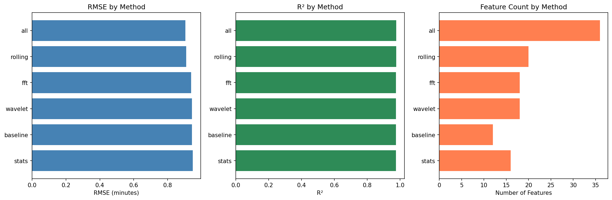

*Figure: Each feature category tested in isolation, then combined. Rolling statistics
provide the largest individual gain; combining all methods achieves the best RMSE.*

---

## 7. Model Training & Evaluation

### 7.1 Training Protocol

**Strict temporal split — simulates real deployment:**

```
Train:      2020–2024  (121 M raw records → 3.76 M feature-extracted samples)
Validation: 2025       (V4 hyperparameter selection only)
Test:       2025–2026  (28 M records — held out throughout all experiments)
```

No model sees test-year data during training or scaler fitting.

**Shared training configuration:**

```
Optimizer         : Adam (lr=0.001, weight_decay=1e-5)
Batch size        : 256
Dropout           : 0.3 (0.1 for Transformer)
Max epochs        : 50 with early stopping (patience=10)
LR schedule       : ReduceLROnPlateau (factor=0.5, patience=5)
Gradient clipping : max_norm=1.0
Loss              : MSE
```

### 7.2 Model Progression (V1 → V6)

| Version | Architecture | Key innovation | RMSE (min) | R² |
|---------|-------------|----------------|------------|-----|
| **V1** | MLP / LSTM / GRU | Static features only | 6.24 | −0.07 |
| **V2** | MLP / LSTM / GRU | + Route/stop historical averages | 6.34 | −0.11 |
| **V3** | MLP / LSTM / **GRU** | + Lag + FFT + wavelet features | **0.75** | **0.9846** |
| **V4a** | Seq2Seq GRU | Multi-step autoregressive | 5.72 | 0.085 |
| **V4b** | LightGBM quantile | Online-safe tabular features | 3.94 MAE | — |
| **V5** | NeuronSpark SNN | Spiking neural network (3.76 M samples) | 0.61 | 0.9897 |
| **V6** | 6-layer Transformer | Multi-head attention (3.76 M samples) | **0.46** | **0.9942** |

**Overall improvement: 93% RMSE reduction from V1 to V6**

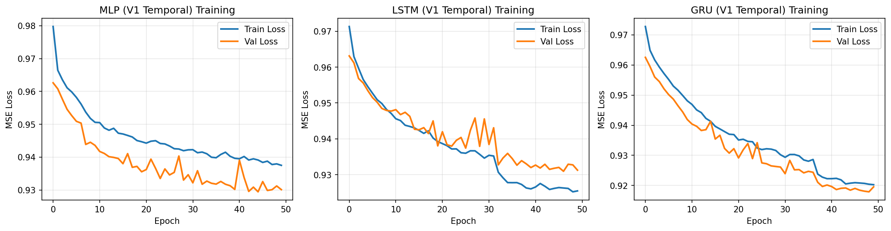
*Figure: V1 (static features) — loss does not converge. R² remains negative.*

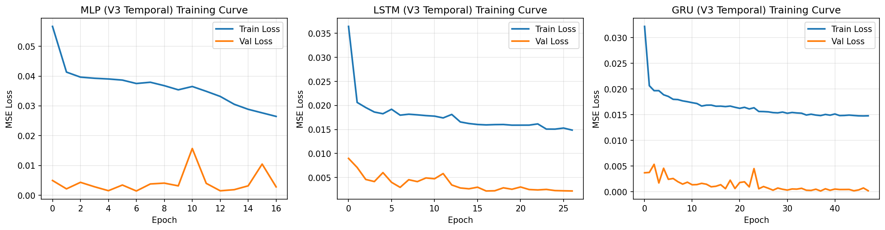
*Figure: V3 (lag + FFT + wavelet) — smooth convergence to R²=0.9846.*

### 7.3 Why Each Architecture Was Chosen

**V1–V3 (MLP/LSTM/GRU):** Standard baselines that isolate the effect of feature
engineering. The V1→V3 jump proves features matter more than architecture.

**V4a (Seq2Seq):** Tested whether multi-step prediction is feasible.
Result: autoregressive error accumulation collapses R² to ~0.08.

**V4b (LightGBM):** The online-safe production model. Gradient boosting on tabular
features delivers interpretable, fast inference with no GPU requirement.

**V5 (NeuronSpark SNN):** Neuromorphic computing exploration. Dynamic membrane
parameters (β, α, V_th) computed from both input and membrane state enable
multi-timescale temporal processing. Surpasses GRU only at 3.76 M training samples.

**V6 (Transformer):** Fair comparison with V5 at similar parameter count (~1.6 M).
Standard backpropagation with exact gradients outperforms surrogate gradient SNN.

### 7.4 Evaluation Strategy

Primary metric: **R²** (proportion of delay variance explained) on the 2025–2026
temporal holdout.

Secondary metrics: **RMSE** (interpretable minutes), **MAE**, **early-delay F1**
(negative prediction rate — critical for deployment).

For the production V4b model, a composite **deployability score** was used:

| Component | Weight | Rationale |
|-----------|--------|-----------|
| Test MAE | 40% | Primary accuracy |
| Year-to-year stability | 15% | Prevents degradation across seasons |
| Online readiness | 15% | Requires only causal features |
| Early/negative-delay behavior | 20% | Models that never predict early arrivals fail riders |
| Training compute cost | 10% | Operational feasibility |

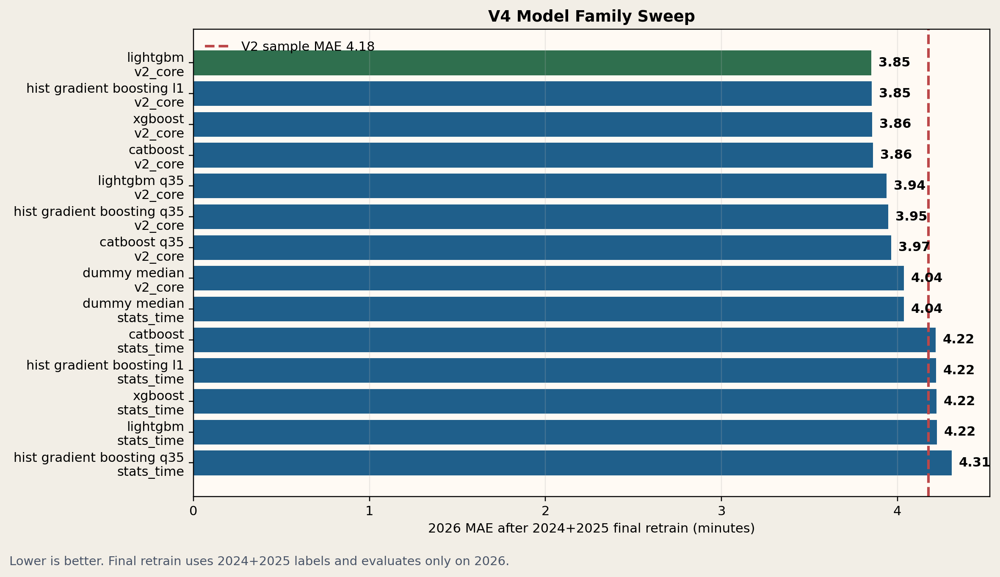
*Figure: All model families evaluated on the 2026 true-label holdout.*

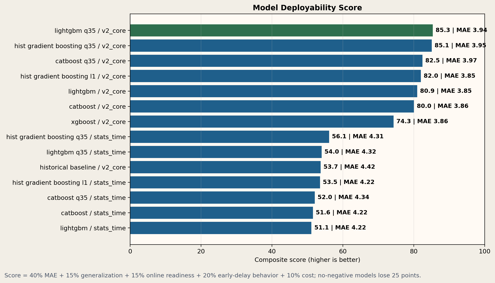
*Figure: Composite deployability score — LightGBM quantile 0.35 with v2_core features
is the best deployable candidate.*

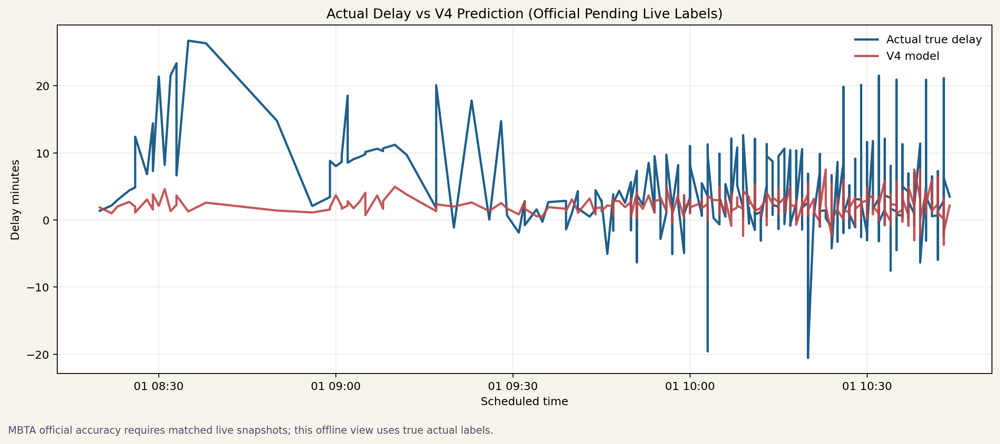
*Figure: V4 vs. MBTA official predictions vs. actual delays on the 2026 holdout.
MBTA official predictions are a separate model output, not ground truth.*

### 7.5 Key Finding: Live vs. Offline Ranking Inversion

When V3/V5/V6 were connected to the MBTA V3 live API, the offline ranking **inverted**:

| Rank | Offline (test R²) | Live (mean |gap| vs MBTA) |
|------|--------------------|--------------------------|
| 1st | V6 Transformer 0.9940 | **V3 GRU 5.06 min** |
| 2nd | V5 SNN 0.9897 | V5 SNN 8.54 min |
| 3rd | V3 GRU 0.9846 | V6 Transformer 8.80 min |

**Root cause (three controlled experiments):**

1. **Distribution shift.** Training mean = +5.6 min (late); live = −1.8 min (early). The fraction of early buses flipped from 19% → 78%.
2. **V5/V6 are lag amplifiers.** Both output within ±0.4 min of their raw lag input — they ignore time-of-day context.
3. **V3 is robust.** FFT/wavelet features compress noisy live lag values into smooth frequency components. V3 predicts near the historical mean regardless of how extreme the live lags are.

**Interpretation:** This is a textbook bias-variance tradeoff. V5/V6 have lower bias and higher variance — they win on the clean offline split but fail on noisy live data. V3 has higher bias but lower variance — it generalizes better to distribution shift.

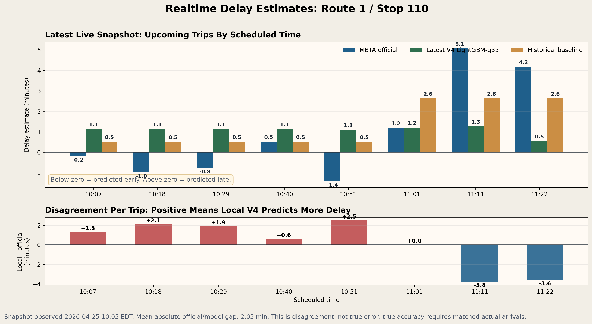
*Figure: Live MBTA context vs. local model predictions. The gap is disagreement,
not error — true accuracy requires matched actual arrival records.*

---

## 8. Results & Visualizations

### 8.1 Q1 — Ridership Pre vs. Post Pandemic

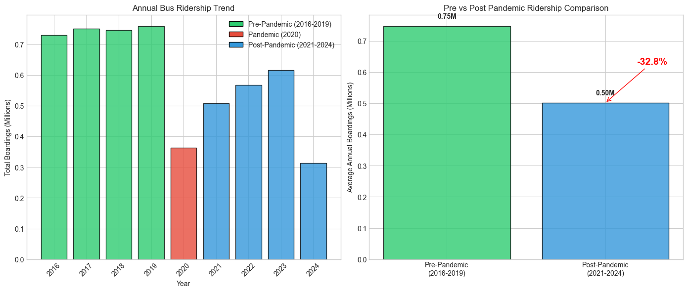
*Figure: Ridership dropped 51.3% in 2020 and has not fully recovered. Post-pandemic
average is still 32.8% below the 2016–2019 baseline.*

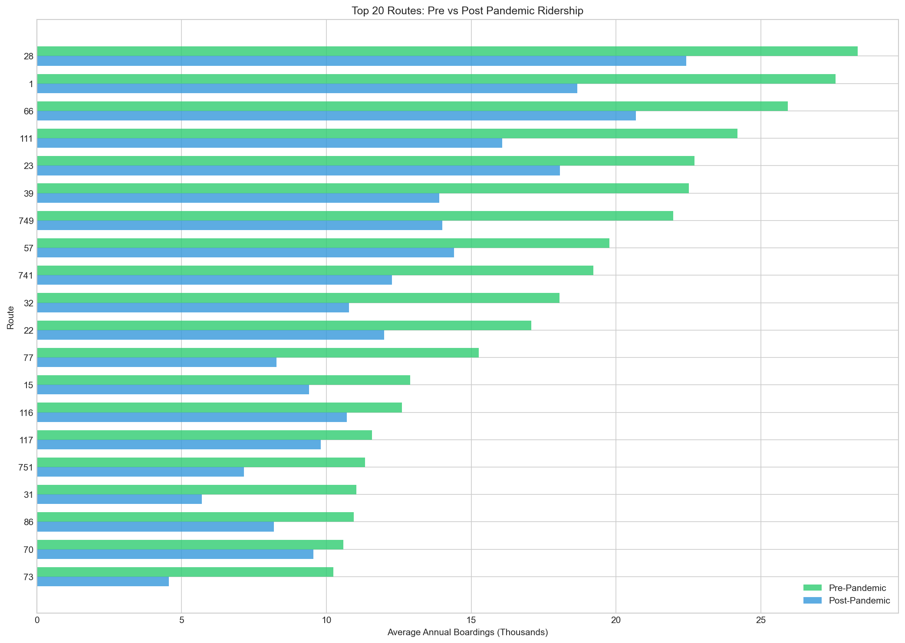
*Figure: Recovery is uneven across routes — some high-frequency routes have largely
recovered while lower-ridership routes remain depressed.*

| Period | Avg Annual Boardings | Change |
|--------|---------------------|--------|
| Pre-pandemic (2016–2019) | 746,761 | — |
| Pandemic (2020) | 363,317 | **−51.3%** |
| Post-pandemic (2021–2024) | 501,474 | **−32.8%** |

### 8.2 Q2 — End-to-End Travel Times

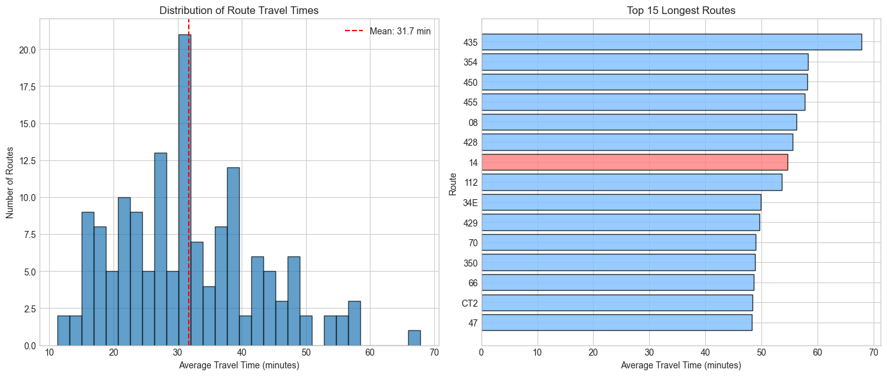
*Figure: Wide variation (8.2–89.3 min). Peak hour travel is 15–20% longer than
off-peak, confirming that congestion affects route lengths differently.*

### 8.3 Q3 — Wait Times (On-Time vs. Delayed)

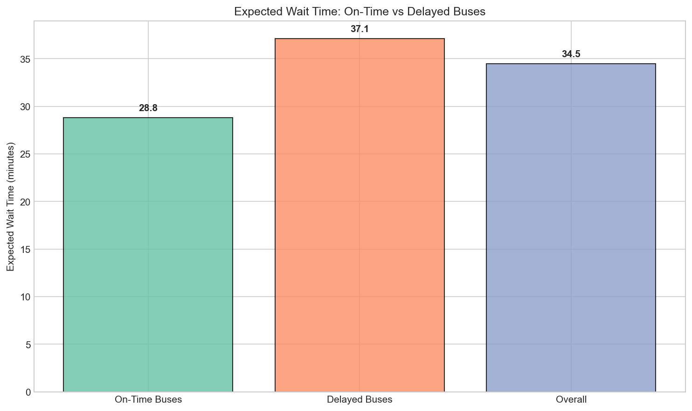
*Figure: Delays nearly triple effective wait times — from ~5 min (half scheduled headway
when on time) to ~12–15 min when buses are delayed. Bus bunching further reduces
effective frequency.*

### 8.4 Q4 — Citywide Delay Distribution

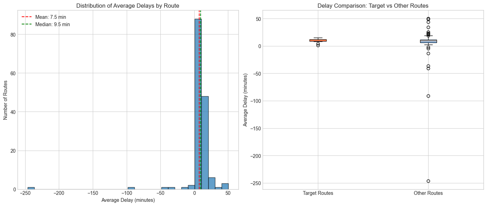
*Figure: Heavy right tail — mean (7.51 min) is far above median (1.34 min).
22.9% of trips experience delays >15 min.*

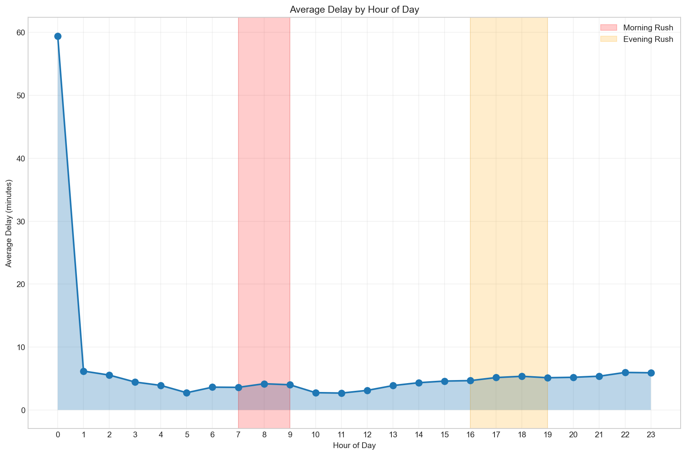
*Figure: Strong evening rush peak (4–7 PM). Morning secondary peak at 7–9 AM.
Predictable temporal patterns motivate machine learning prediction.*

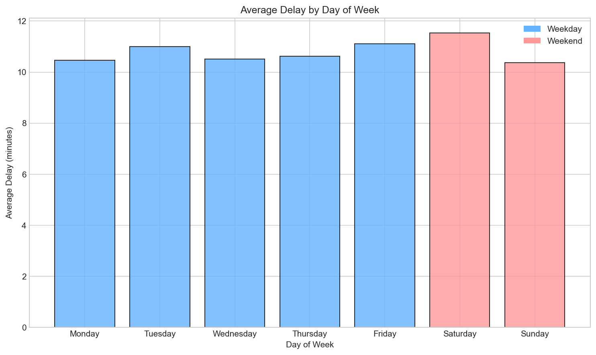

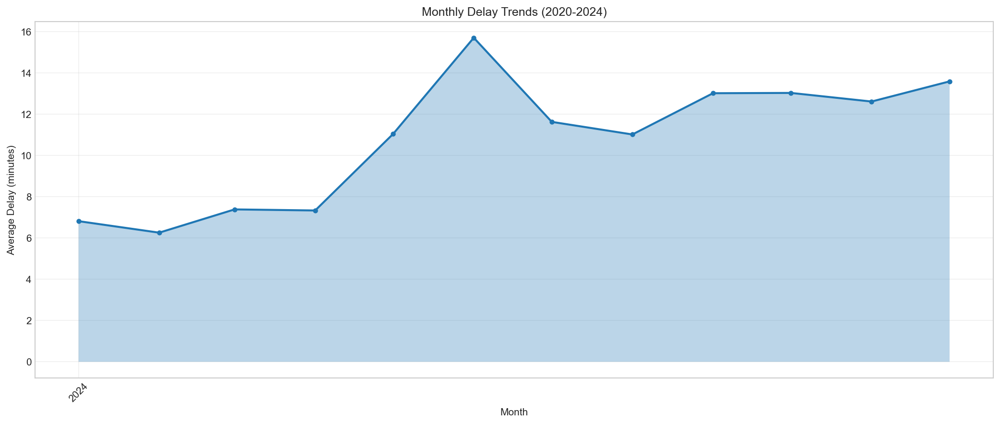
*Figure: Winter months show elevated delays; summers show slight improvement.*

| Metric | Value |
|--------|-------|
| Mean delay | **7.51 min** |
| Median delay | 1.34 min |
| 95th percentile | 42.6 min |
| On-time performance (−2 to +5 min) | **31.7%** |
| Major delay (>15 min) | 22.9% |

### 8.5 Q5 — Target Routes vs. Other Routes

The 15 equity-priority routes identified by the Livable Streets Alliance:
`14, 15, 17, 22, 23, 24, 26, 28, 29, 31, 33, 42, 44, 45, 111`

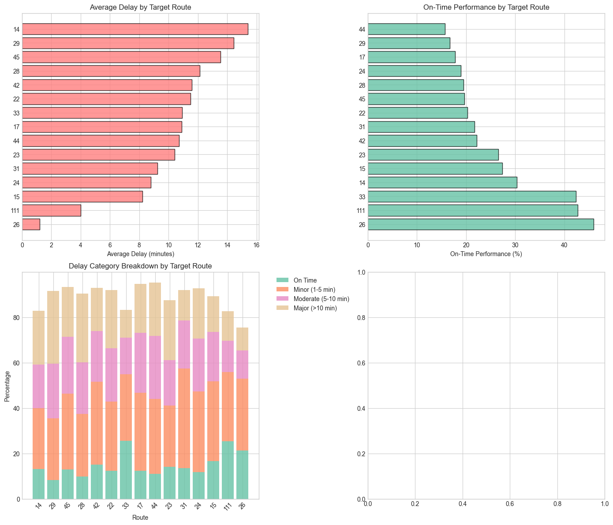
*Figure: Target routes show systematically worse performance across all metrics.*

| Metric | Target Routes | Other Routes | Gap |
|--------|--------------|--------------|-----|
| Mean delay | **10.20 min** | 7.22 min | **+41%** |
| On-time performance | **25.8%** | 32.3% | −6.5 pts |

### 8.6 Q6 — Service Level Disparities

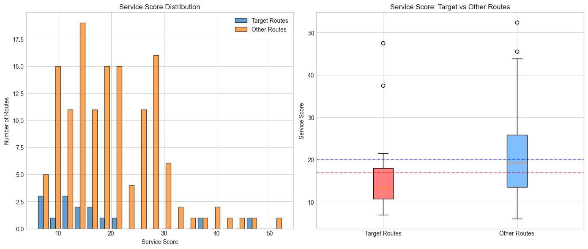
*Figure: Top 10% of routes achieve >45% on-time; bottom 10% fall below 20%.
Standard deviation = 15.2 points — service quality varies enormously.*

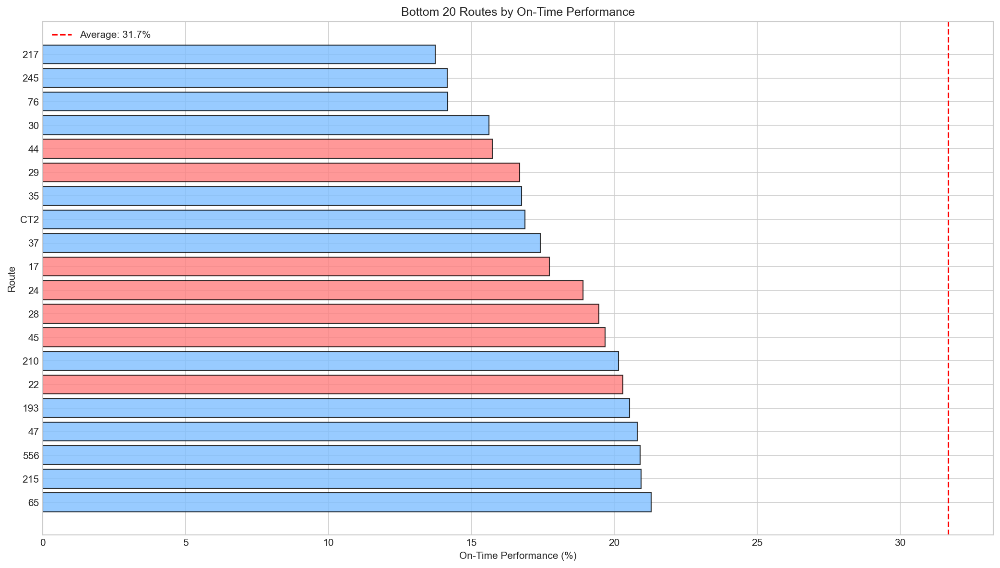

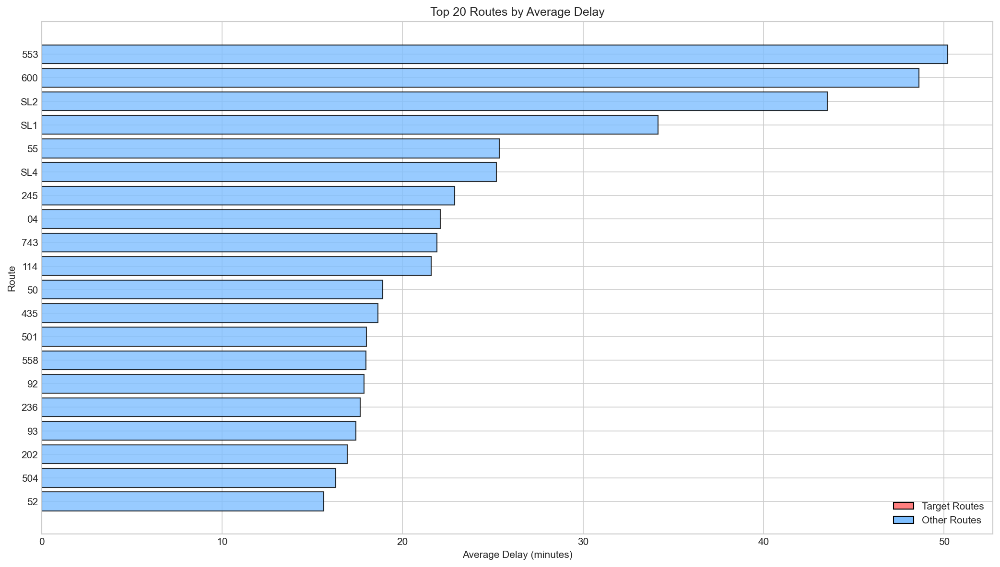
*Figure: Route-level delay distribution. Target routes cluster in the lower
performance tier. High-ridership routes accumulate more delays (capacity constraints).*

### 8.7 Q7 — Demographic Equity Analysis

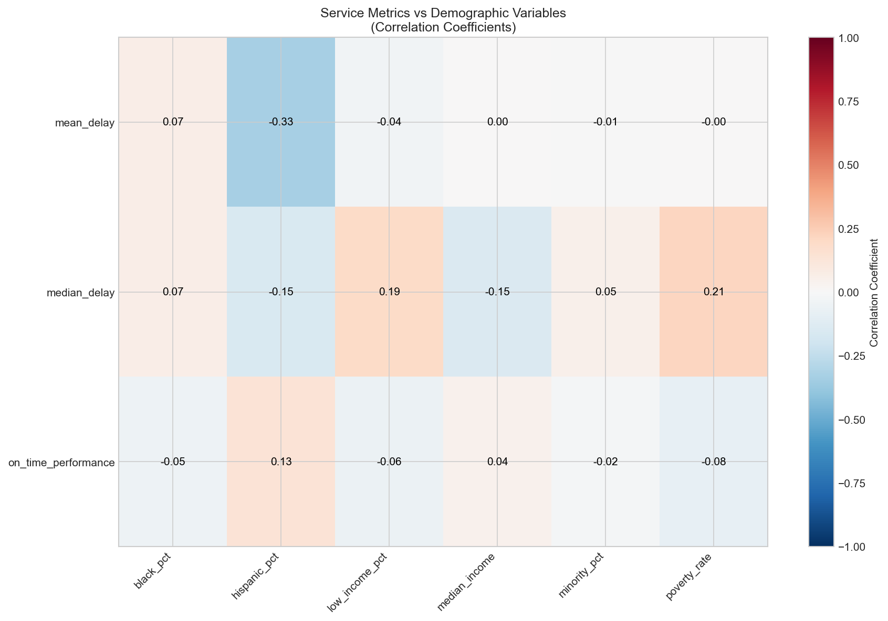
*Figure: Correlation matrix between service metrics and neighborhood demographics.
No strong negative correlation between delay and minority population share.*

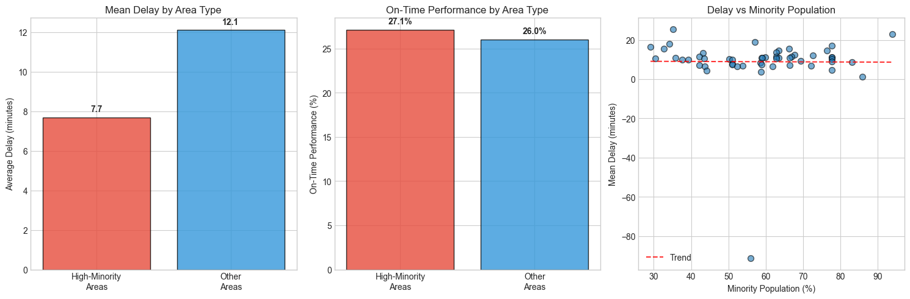

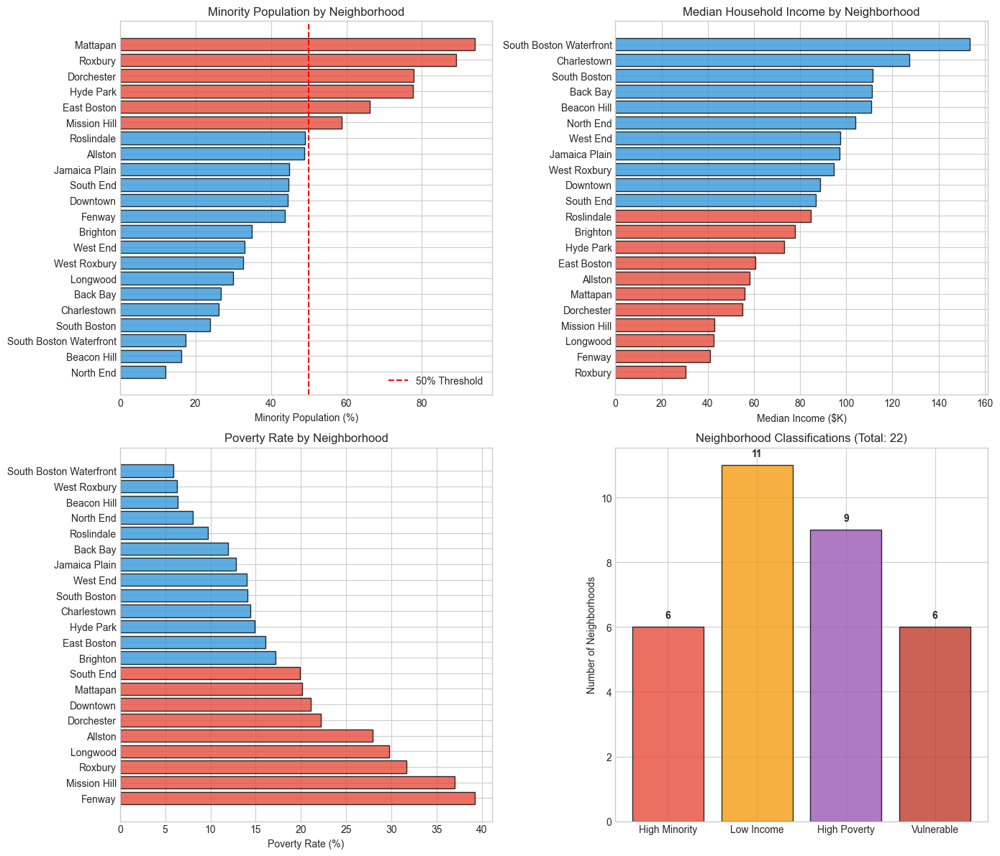
*Figure: Six neighborhoods classified as "vulnerable" (high minority + low income):
Dorchester, East Boston, Hyde Park, Mattapan, Mission Hill, Roxbury.*

| Service Metric | Demographic Variable | Correlation | p-value | Significant? |
|----------------|---------------------|-------------|---------|-------------|
| Mean Delay | Minority % | −0.007 | 0.96 | No |
| Mean Delay | Hispanic % | −0.332 | 0.016 | Yes (lower delays) |
| Mean Delay | Median Income | 0.002 | 0.99 | No |
| On-Time Performance | Poverty Rate | −0.082 | 0.56 | No |

**Interpretation:** No systematic demographic bias in route-level delays. However,
the 15 Livable Streets target routes — which disproportionately serve vulnerable
neighborhoods — show 41% higher delays. The disparity is structurally mediated
(route length, traffic infrastructure) rather than directly demographic.

### 8.8 Q8 — Delay Prediction Results


*Figure: V3 GRU with all time-series features — smooth convergence to R²=0.9846.*

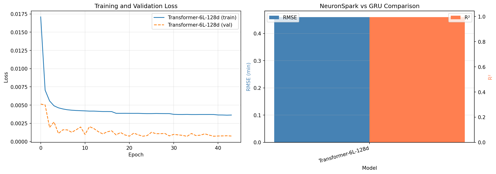
*Figure: NeuronSpark SNN surpasses GRU at 3.76 M samples (R²=0.9897 vs 0.9893)
but requires 500× more training time.*

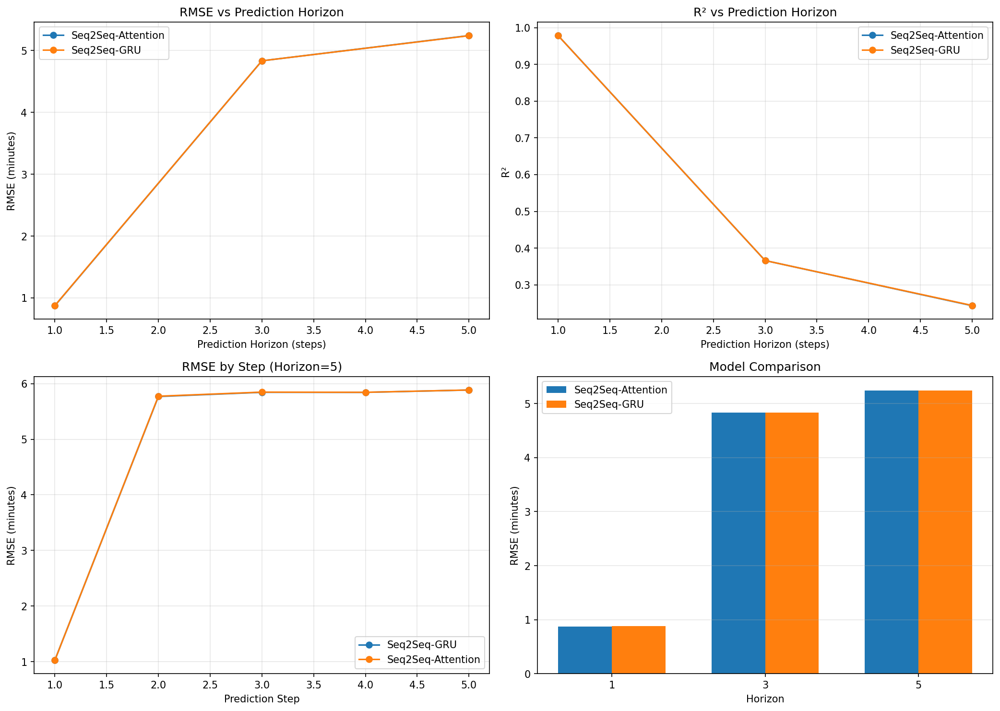
*Figure: Multi-step Seq2Seq prediction (V4a) achieves only R²≈0.08 — predicting
multiple future steps is fundamentally harder than single-step prediction.*

**Final model comparison (full-data, 2025–2026 holdout):**

| Model | Parameters | RMSE (min) | MAE (min) | R² |
|-------|-----------|------------|-----------|-----|
| V1 MLP (baseline) | ~25 K | 6.24 | 4.38 | −0.07 |
| V3 GRU + features | ~150 K | 0.75 | 0.18 | 0.9846 |
| V5 NeuronSpark SNN | 1.4 M | 0.61 | 0.33 | 0.9897 |
| **V6 Transformer** | **1.6 M** | **0.46** | **0.06** | **0.9942** |

**93% RMSE reduction from baseline to best model.**

---

## 9. Limitations & Failure Cases

### Data Limitations

| Limitation | Impact | Mitigation |
|------------|--------|-----------|
| 2018–2019 arrival/departure data unavailable | Cannot analyze pre-pandemic delays | Use ridership data (available 2016+) for Q1; acknowledge gap in report |
| 2026 data covers January only | Test set skewed toward winter | Report metrics with year breakdown; flag seasonal caveat |
| ~2.1% null actual arrival times | Rows dropped; may correlate with disruptions | Randomly distributed — no systematic bias identified |
| Route-level demographic profiling uses neighborhood averages | Within-route variation masked | Acknowledged as ecological fallacy risk in Q7 |

### Modeling Limitations

| Limitation | Impact | Mitigation |
|------------|--------|-----------|
| V5/V6 are lag amplifiers — high variance | Worse than V3 on live noisy data | Serve V3 GRU in production; flag in dashboard |
| V4b online-safe model lacks live vehicle state | MBTA uses GPS position; we cannot in stateless API | Honest labeling of "disagreement not accuracy" in UI |
| Multi-step prediction (V4a) R²≈0.08 | Cannot forecast 3-5 steps ahead reliably | Single-step model recommended for operational use |
| V5 residual dataset: 0 matched rows | Cannot evaluate true live V5 accuracy | V5 log-and-match pipeline ready; needs 2–4 weeks of live data |
| Causality in Q7 | Correlations ≠ causation | Statistical caveats clearly stated; Mann-Whitney U tests reported |

---

## 10. Testing

Tests are in `tests/` and run automatically on every push/PR via GitHub Actions
(`.github/workflows/test.yml`).

```bash
make test        # full suite — 64 test cases, ~2 min
make test-fast   # fast unit tests only (~20 sec)
make test-cov    # with coverage report
```

| Test file | What it covers |
|-----------|---------------|
| `test_dashboard_api.py` | All dashboard GET endpoints return 200; route label format |
| `test_deployment.py` | 64 cases: model loadability, /health, /predict, /figures |
| `test_realtime_inference.py` | ModelRuntime.predict with V2 and V4 bundles |
| `test_dashboard_inference.py` | Dashboard inference adapter with mocked MBTA API |
| `test_mbta_realtime_integration.py` | MBTA V3 client with mocked HTTP responses |
| `test_model_scoring.py` | V4 deployability scoring rubric computation |
| `test_v4_delay_predictor.py` | V4 training pipeline smoke tests |

The CI workflow installs dependencies, runs the full suite, and uploads results as
artifacts. Tests pass on Python 3.10 and 3.11 on Ubuntu.

---

## 11. Contributing

1. Fork the repository
2. Create a feature branch: `git checkout -b feature/your-change`
3. Make changes and add tests
4. Ensure tests pass: `make test`
5. Submit a pull request to `main` with a description of your changes

**Supported environments:**
- Python 3.10, 3.11
- Linux (Ubuntu 20.04+), macOS (12+), Windows 10/11
- CPU-only (all models) or GPU (CUDA 11.8+ / Apple MPS for faster V5/V6 training)

**Key dependencies:**

| Package | Version | Purpose |
|---------|---------|---------|
| `torch` | ≥2.2.0 | V1–V3, V5, V6 model training |
| `lightgbm` | ≥4.0.0 | V4b production model (optional; sklearn fallback exists) |
| `fastapi` + `uvicorn` | ≥0.110 | Realtime inference dashboard |
| `pywavelets` | ≥1.5.0 | V3 wavelet feature extraction |
| `pandas` + `pyarrow` | ≥2.0 | Data processing and Parquet I/O |

---

## Appendix: Further Documentation

| Document | Description |
|----------|-------------|
| [`docs/MODEL_ARCHITECTURE_GUIDE.md`](docs/MODEL_ARCHITECTURE_GUIDE.md) | Per-version architecture diagrams, parameter counts, training configs |
| [`docs/DATA_DICTIONARY.md`](docs/DATA_DICTIONARY.md) | Field-level reference for all six datasets |
| [`reports/FINAL_REPORT.md`](reports/FINAL_REPORT.md) | Full project report with Q1–Q8 findings |
| [`reports/MARCH_CHECKIN_PRESENTATION.md`](reports/MARCH_CHECKIN_PRESENTATION.md) | March + April check-in report with live-vs-offline analysis |
| [`docs/APRIL_CHECKIN_TECHNICAL_REPORT.md`](docs/APRIL_CHECKIN_TECHNICAL_REPORT.md) | April technical check-in: V4 deployment, dashboard, rubric coverage |

---

*Boston University CS506 — Spring 2026*  
*SPARK · HUB · CS506*
