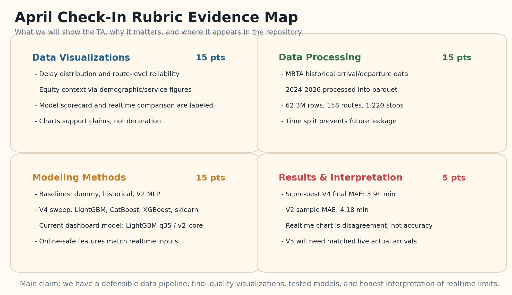
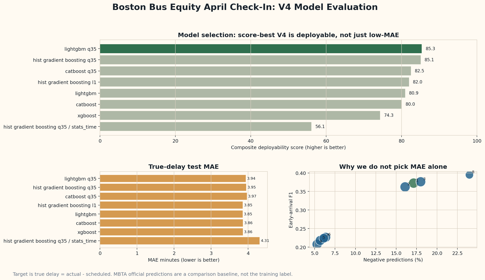
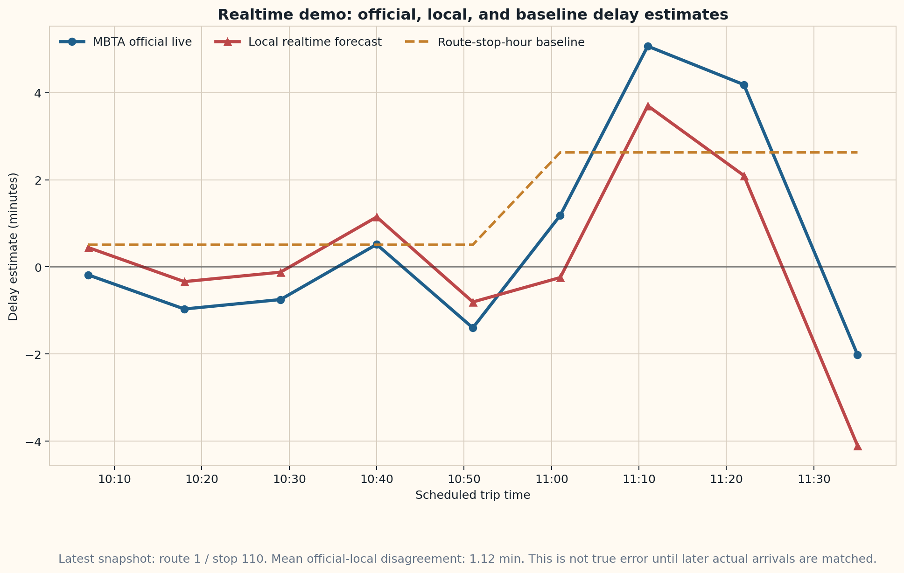

# Boston Bus Equity: April Check-In TA Handout

Course checkpoint: April project check-in  
Audience: TA / course staff  
Main claim: we have a defensible data pipeline, final-quality visualizations, tested delay-prediction models, and an honest realtime dashboard prototype.

## 90-Second Summary

Our project studies whether Boston bus service reliability is uneven across routes and communities, then builds a local realtime delay-prediction prototype. We use MBTA historical arrival/departure data as the main source of true delay labels, defined as:

```text
delay_minutes = actual arrival/departure time - scheduled time
```

For the April check-in, we processed 2024-2026 MBTA arrival/departure data into a parquet dataset, built online-safe features, trained and compared several model families, and added a FastAPI dashboard that compares our local forecast with MBTA's live official predictions. We are careful not to overclaim: official-vs-local live charts show model disagreement unless we later match live snapshots to actual arrivals.

## Rubric Evidence Map



This figure is the fastest way to explain what is complete for the check-in. It maps the four April rubric categories to repository evidence.

Why this visualization: the rubric itself is categorical, so an evidence-map card layout is clearer than a scatter plot or histogram. It is not a statistical result; it is a checklist showing coverage.

## 1. Data Visualizations

Rubric target: at least one relevant visualization, clear labels, and a visualization that supports an important claim.

### Figure A. Route-Level Delay Differences


Claim supported: bus reliability is not uniform across routes.

Why this chart: route is a categorical variable, so a sorted bar chart is appropriate. A scatter plot would imply a continuous x-axis that routes do not have. A pie chart would be misleading because delay is not a share-of-whole quantity.

How to defend it: this chart supports the project motivation that reliability burdens differ by route. It does not by itself prove demographic causation; that is why we also include demographic/service context.

### Figure B. Demographic and Service Context


Claim supported: service equity should be evaluated with both operational metrics and neighborhood context.

Why this chart: grouped comparisons make it easier to compare service outcomes across demographic/service categories. This is more relevant than showing raw tables because the TA can quickly see whether service quality differs across groups.

Limitation: demographic correlation should be interpreted as context, not proof that demographics cause delay.

### Figure C. Model Evaluation Scorecard



Claim supported: we did not test only one model; we compared multiple deployable candidates and selected the current dashboard model based on more than raw MAE.

Why this chart: the top panel shows a composite deployability score; the lower-left panel shows true-delay MAE; the lower-right panel shows the early-arrival tradeoff. This is more defensible than a single MAE bar chart because realtime users care about early arrivals and online feasibility, not only average error.

Important interpretation: the score-best deployed model is `lightgbm_q35 / v2_core`. It is not the lowest-MAE model, but it better balances negative/early-delay behavior and online-readiness.

### Figure D. Realtime Official vs Local vs Baseline



Claim supported: the realtime comparison pipeline is running and can place MBTA official predictions, our local forecast, and a historical route-stop-hour baseline on the same scheduled-trip axis.

Why this chart: a line chart is appropriate because the observations are ordered by scheduled trip time. A box plot would hide the trip sequence; a pie chart would be unrelated.

Important limitation: this chart is model-to-model disagreement, not true live accuracy. True live accuracy requires matching each live prediction snapshot to the eventual actual arrival/departure.

## 2. Data Processing

Rubric target: clear data sources, close-to-final cleaning steps, and a clear reason for processing decisions.

### Data Sources

| Source | Role | Collection method |
|---|---|---|
| MBTA historical arrival/departure data | Main source for true delay labels | `src/data/download_data.py` and `src/data/convert_all_to_parquet.py` |
| MBTA V3 `/predictions` API | Official live arrival/departure estimates for comparison | Dashboard and live snapshot logger |
| MBTA V3 `/vehicles` API | Live vehicle fields such as vehicle id, status, sequence, speed when available | Joined to live prediction snapshots |
| Project demographic/service data | Equity context | Existing project analysis and report figures |

### Processed Dataset

| Item | Current value |
|---|---:|
| Processed file | `data/processed/arrival_departure.parquet` |
| Rows | 62.3 million |
| Years | 2024, 2025, 2026 |
| Routes | 158 |
| Stops | 1,220 |
| Directions | 2 |

### Cleaning and Feature Decisions

1. Convert raw MBTA data into parquet so repeated model training and reporting are fast enough.
2. Normalize route, stop, and direction identifiers so historical files and realtime API rows use consistent keys.
3. Use true delay as the label: `actual - scheduled`.
4. Use time-based splits rather than random splits. Random splits would leak future operating patterns into training.
5. Use online-safe features for realtime inference: route, stop, direction, scheduled headway, time flags, and historical route/stop/hour statistics.
6. Reject unknown route/stop ids rather than fabricating encodings. This avoids confident predictions for categories the model did not learn.

## 3. Modeling Methods

Rubric target: at least one modeling method attempted, at least one performance test, and clear justification for features/model.

### Baselines and Models Tested

| Model or baseline | Why it matters |
|---|---|
| Dummy median baseline | Minimum sanity check |
| Historical route-stop-hour baseline | Simple online-safe operational baseline |
| V2 MLP causal baseline | Earlier neural baseline with 18 causal statistics |
| LightGBM | Strong tabular model and current dashboard family |
| CatBoost | Alternative boosting family |
| XGBoost | Alternative boosting family |
| sklearn HistGradientBoosting | Dependency-light tree baseline |

### Current Dashboard Model

```text
Bundle: models/delay_predictor_v4_score_best_online_safe_bundle.joblib
Runtime name: V4Tree
Model kind: lightgbm_q35
Feature profile: v2_core
Feature count: 18
Training protocol: final_2024_2025_to_2026
```

Why this model: LightGBM is a strong baseline for tabular, mixed categorical/time/statistical features. The `q35` candidate was chosen because it improves early/negative-delay behavior while staying deployable in a stateless realtime API.

Why not rely on the old V3 sequence model: V3 uses sequence/wavelet-style features that are useful offline but not reliably constructible from a single realtime request. The dashboard model must use features available before the bus arrives.

## 4. Results and Interpretation

Rubric target: results are presented and accurately interpreted.

### Offline True-Label Results

| Result | Value |
|---|---:|
| Score-best V4 final MAE | 3.94 min |
| Score-best V4 final RMSE | 6.19 min |
| Score-best V4 early-arrival F1 | 0.373 |
| Score-best V4 negative-prediction rate | 17.1% |
| V2 sample MAE | 4.18 min |
| Dummy median baseline final MAE | about 4.04 min |
| Historical baseline final MAE | about 4.42 min |

Interpretation: V4 is a real trained model and improves over simple baselines, but the improvement is modest. That is expected because the current dashboard is intentionally online-safe and stateless. MBTA official predictions can still outperform our independent model because MBTA has richer live vehicle and operations data.

### Realtime Interpretation

The realtime chart is useful for demonstrating the live pipeline, but it is not yet a final accuracy metric. The correct statement is:

```text
We can compare MBTA official live estimates, our local realtime estimate, and a historical baseline for upcoming trips. This is disagreement until actual arrivals are matched.
```

The next modeling step is V5 residual correction:

```text
target = actual_delay - official_delay
prediction = official_delay + learned residual correction
```

This should only be trained after enough live prediction snapshots are matched to later actual arrival/departure labels.

## Dashboard Demo

Run locally:

```powershell
C:\Users\yaobc\anaconda3\python.exe -m src.inference.serve `
  --bundle models\delay_predictor_v4_score_best_online_safe_bundle.joblib `
  --host 0.0.0.0 `
  --port 8000
```

Open:

```text
http://127.0.0.1:8000/
```

What the TA should see:

- route and stop dropdowns, not free-text ids;
- a local delay prediction for a scheduled bus arrival;
- a chart whose time window follows the current prediction data;
- MBTA official vs local vs historical baseline comparison;
- model metrics and curated project visualizations;
- uncertainty bands based on held-out RMSE, not artificial random noise.

## Questions We Are Prepared To Answer

### Why use a bar chart for route delays?

Routes are categories, and the claim is about comparing categories. A bar chart makes route-to-route differences readable. A scatter plot would suggest a continuous relationship between route ids that does not exist.

### Why use line charts for realtime predictions?

Realtime predictions are ordered by scheduled trip time. A line chart preserves the temporal/trip order and shows how estimates change across upcoming trips.

### Is the realtime chart misleading?

It would be misleading if we called it accuracy. We label it as official-local disagreement. True accuracy requires later matching to actual arrival/departure outcomes.

### Why not choose the absolute lowest-MAE model?

Realtime prediction also needs early-arrival behavior, stability, online-safe features, and low runtime cost. A model that has slightly lower MAE but almost never predicts early arrivals can be less useful for users.

### What is the biggest current limitation?

The independent V4 model has limited live context. It does not yet have enough matched live labels to learn how to correct MBTA official predictions. V5 will address that once live snapshots are matched to actual outcomes.

