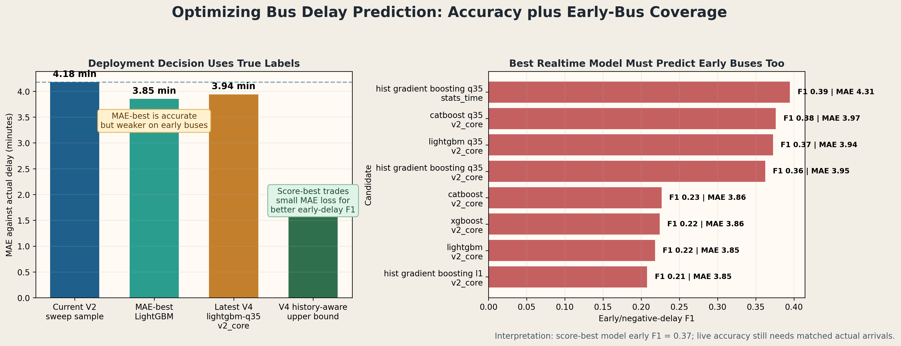

# April Project Check-In Technical Report

Project: **Boston Bus Equity**  
Course deliverable: **CS506 April check-in**  
Current implementation status: **local FastAPI dashboard + online-safe V4 realtime delay model**

## Rubric Coverage Summary

| Rubric area | What we will show | Evidence in this repo |
|---|---|---|
| Data visualizations | Clear visual evidence for delay distributions, route disparities, model comparison, and realtime prediction behavior | Figures in `reports/figures/` embedded below |
| Data processing | MBTA historical arrival/departure data, MBTA V3 live prediction/vehicle API, strict time-based preprocessing | `src/data/`, `src/inference/build_bundle.py`, `src/models/train_delay_predictor_v4.py` |
| Modeling methods | Historical baseline, prior neural baseline, V4 LightGBM/CatBoost/XGBoost/sklearn sweep, realtime V4 bundle | `src/models/`, `src/inference/runtime.py`, `reports/V4_MODEL_SWEEP_REPORT.md` |
| Results and interpretation | True-label MAE/RMSE/R2, baseline comparison, deployability score, honest live interpretation | `reports/MODEL_SCORING_GUIDE.md`, `reports/MBTA_REALTIME_OFFICIAL_VS_MODEL.md` |

## 1. Data Visualizations

### Figure 1. Delay Distribution


This distribution establishes the target variable for modeling: delay in minutes. A histogram is appropriate because the first question is not about individual points but about the shape of the delay population. It also shows why predicting negative/early arrivals matters: early arrivals are rare but operationally important, so a model that never predicts negative delay is not acceptable for realtime use.

### Figure 2. Delays by Route


This route-level comparison supports the project claim that service reliability is not uniform across the bus system. A route-level bar chart is preferable to a scatter plot here because each route is a category and the point is to compare ordered route groups. It is directly relevant to the equity hypothesis: if delays concentrate on routes serving specific neighborhoods, the operational burden is not evenly distributed.

### Figure 3. Demographic Correlation Heatmap


The heatmap summarizes whether service performance metrics are strongly associated with demographic variables. The result is useful even when correlations are weak, because it prevents overclaiming: the project can distinguish measured service disparities from unsupported demographic-causation claims.

### Figure 4. V4 Model Family Sweep


This figure compares multiple model families on true delay labels rather than on MBTA official predictions. It supports the modeling claim that the latest V4 tabular boosting approach is a stronger online-safe baseline than simple historical or dummy baselines.

### Figure 5. Deployability Score


The best production candidate is not chosen by MAE alone. The score combines accuracy, stability, online-readiness, early-delay behavior, and compute cost. This is important because a model with slightly better MAE but no negative-delay predictions would look good numerically but fail a realtime user-facing requirement.

### Figure 6. Offline Performance Against Actual Labels


This is the most important performance visualization because it uses actual arrival/departure outcomes. It separates true model quality from model-to-model disagreement with MBTA official predictions.

### Figure 7. Realtime Official, Baseline, and Local Estimates


This figure is for presentation of the realtime dashboard. It compares MBTA official predictions, the latest local V4 estimate, and a route-stop-hour historical baseline for current upcoming trips. It should be described carefully: without later matched actual arrivals, this is **disagreement**, not true prediction error.

### Figure 8. Optimization Interpretation



This figure explains why purely stateless realtime requests can look flat. Without live trip history, previous-stop delay, vehicle location, speed, and matched official residual labels, a local model has less information than MBTA's official realtime system.

## 2. Data Processing

### Data Sources

| Source | Use in project | Collection method |
|---|---|---|
| MBTA historical bus arrival/departure data | Main source for true delay labels: `actual - scheduled` | Downloaded by `src/data/download_data.py` and converted by `src/data/convert_all_to_parquet.py` |
| MBTA V3 `/predictions` API | Official live arrival/departure predictions for comparison | Pulled on demand by realtime dashboard and snapshot logger |
| MBTA V3 `/vehicles` API | Live vehicle context such as vehicle id, stop sequence, status, and speed when available | Joined to prediction snapshots in `src/inference/log_mbta_live_snapshots.py` |
| Existing project demographic/geographic inputs | Equity analysis and context for service disparities | Used in base project notebooks/reports |

### Cleaning and Transformation Steps

1. Raw MBTA CSV files are converted into a columnar `arrival_departure.parquet` file for faster repeated analysis.
2. Scheduled and actual timestamps are parsed into timezone-aware datetimes.
3. The target label is computed as `delay_minutes = actual_time - scheduled_time`.
4. Route, stop, and direction identifiers are normalized as strings so historical files, realtime API responses, and model bundles use consistent keys.
5. Extreme or invalid rows are filtered before model training so the model is not dominated by data-entry artifacts.
6. Features are built with strict temporal rules. Training statistics use historical data only; future test labels are not used to compute scalers, encoders, or aggregate delay statistics.
7. Realtime bundles store numeric scaler parameters, route/stop/direction vocabularies, and historical route-stop-hour statistics so the web service can predict without reloading the training data.

### Why These Processing Decisions Are Defensible

- A time-based split is required because bus delay prediction is a temporal forecasting problem. Random train/test splitting would leak future operating patterns into training.
- Route-stop-hour historical statistics are used because they are available online before the bus arrives and capture recurring schedule adherence patterns.
- The V3 wavelet/sequence research model is not the default realtime model because those features are not available in a stateless single-request API.
- Unknown route or stop ids are rejected rather than fabricated. This prevents the model from producing confident predictions for categories it never learned.

## 3. Modeling Methods

### Target

The model target is **true delay**:

```text
delay_minutes = actual_arrival_or_departure_time - scheduled_time
```

MBTA official predictions are treated as a comparison signal, not as the training label for V4. This matters because matching the official system would not prove that our model predicts actual service outcomes.

### Baselines

| Baseline | Purpose |
|---|---|
| Dummy median model | Minimum statistical baseline; any useful model should beat it |
| Route-stop-hour historical baseline | Online-safe operational baseline used in the dashboard |
| Prior causal neural baseline | Earlier V2 MLP using 18 causal features |
| MBTA official prediction | External live comparison, not a supervised training target for V4 |

### V4 Model Sweep

The V4 sweep tested multiple tabular model families:

- LightGBM
- CatBoost
- XGBoost
- sklearn HistGradientBoosting
- ExtraTrees / tree-style baselines where available
- Ridge / linear baselines where available
- Dummy median baseline
- Historical baseline

Feature profiles included:

- `v2_core`: 18 online-safe causal features such as encoded route/stop/direction, time flags, scheduled headway, and historical delay statistics.
- `stats_time`: expanded statistical/time features. These can improve training fit but are less robust when live fields are missing.

### Current Best Dashboard Model

The dashboard currently loads:

```text
models/delay_predictor_v4_score_best_online_safe_bundle.joblib
```

Runtime health reports:

```text
model = V4Tree
model_kind = lightgbm_q35
feature_profile = v2_core
training_protocol = final_2024_2025_to_2026
```

The chosen model is `lightgbm_q35 / v2_core`. It is not the absolute lowest-MAE candidate, but it is the best deployable candidate under the scoring rubric because it improves early/negative-delay behavior while remaining online-safe.

## 4. Preliminary Results and Interpretation

### Offline Model Metrics

| Model/result | Metric | Value |
|---|---:|---:|
| Best MAE-only V4 candidate, LightGBM `v2_core` | final 2024+2025 to 2026 MAE | 3.852 min |
| Deployed score-best V4 candidate, LightGBM quantile `v2_core` | final 2024+2025 to 2026 MAE | 3.939 min |
| Deployed score-best V4 candidate | final RMSE | 6.193 min |
| Deployed score-best V4 candidate | final early-delay F1 | 0.373 |
| Deployed score-best V4 candidate | final negative-prediction rate | 17.1% |
| Dummy median baseline | final MAE | 4.038 min |
| Historical baseline `v2_core` | final MAE | 4.418 min |
| Prior causal baseline sample | sample MAE | 4.177 min |

Interpretation:

- The latest V4 model improves over the dummy median baseline and historical baseline on true-label evaluation.
- The MAE improvement is modest, which is expected because the default dashboard request is stateless and lacks full live trip history.
- The selected quantile model intentionally trades a small MAE loss for better early-arrival behavior. This directly addresses the observed weakness where earlier models predicted mostly positive delays.

### Realtime Comparison

Latest realtime comparison report:

```text
route = 1
stop = 110
prediction rows = 27
mean absolute official/local gap = 2.051 minutes
mode = official_vs_model
```

This is not the same as accuracy. It measures disagreement between MBTA official predictions and the local model. True live accuracy requires matching each prediction snapshot to the eventual actual arrival/departure, which is the purpose of the V5 residual dataset pipeline.

## 5. Current Realtime Dashboard

The project now includes a user-facing FastAPI dashboard:

```powershell
C:\Users\yaobc\anaconda3\python.exe -m src.inference.serve `
  --bundle models\delay_predictor_v4_score_best_online_safe_bundle.joblib `
  --host 0.0.0.0 `
  --port 8000
```

Open locally:

```text
http://127.0.0.1:8000/
```

The dashboard includes:

- synced route and stop dropdowns so invalid route-stop combinations are avoided;
- local delay prediction for a scheduled bus arrival;
- MBTA live official vs local vs baseline comparison;
- automatic fallback to an active live route-stop when the selected stop has no current MBTA predictions;
- current V4 model-selection and realtime figures;
- plain-English explanations of data processing and modeling.

## 6. What We Plan To Do Next

1. Continue logging MBTA live predictions and later actual arrivals.
2. Build the V5 residual dataset with label `actual_delay - official_delay`.
3. Train a residual correction model that outputs `official_delay + local_residual_correction`.
4. Report paired live MAE only after enough matched prediction/actual rows exist.
5. Keep the independent V4 model for interpretability and offline benchmarking, but treat V5 as the better realtime product once labels are available.

## 7. Questions We Are Prepared To Answer

**Why not just compare our model to MBTA official predictions?**  
Because MBTA official predictions are not ground truth. The correct target is actual arrival/departure delay. Official-vs-local comparison is useful operationally but should not be reported as model error.

**Why use boosting instead of only neural networks?**  
The realtime API needs online-safe tabular features and fast inference. Gradient boosting models are strong, interpretable baselines for tabular data and provide feature importance and fast deployment. Neural sequence models remain useful for offline research when full historical windows are available.

**Why does the realtime model sometimes look flat?**  
If the request only contains route, stop, schedule time, and headway, the model has limited live context. MBTA's official system has vehicle location and schedule adherence information. The fix is not only a new plot; it is collecting live trip-history and training V5 residual correction.

**Is the visualization misleading?**  
The dashboard labels realtime charts as disagreement unless actual labels are matched. The offline model metrics are evaluated against actual historical labels and are the primary source for accuracy claims.

