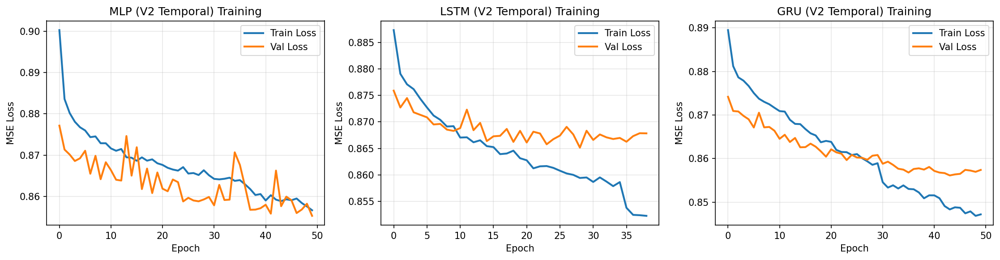

# Boston Bus Delay Prediction - Experiment Report

## Overview

This report documents the iterative development and optimization of bus delay prediction models for the MBTA bus system. We conducted multiple experiments to progressively improve prediction accuracy through data preprocessing enhancements, feature engineering, and model architecture optimization.

**Key Achievement**: Final model achieves **R² = 0.9942** with **RMSE = 0.46 minutes** using Transformer, outperforming NeuronSpark SNN (R²=0.9897) and representing a 93% improvement from the baseline.

---

## 1. Data Preprocessing

### 1.1 Dataset Description

| Item | Description |
|------|-------------|
| Data Source | MBTA Bus Arrival/Departure Records |
| Total Records | 161,115,363 |
| Time Range | January 2020 - January 2026 |
| Key Fields | service_date, route_id, stop_id, scheduled, actual, scheduled_headway |

### 1.2 Data Cleaning

- **Missing Value Handling**: Removed records with null values in `delay_minutes`, `scheduled`, or `service_date`
- **Outlier Filtering**: Retained only delays within [-30, 60] minutes to remove anomalies
- **Datetime Parsing**: Converted timestamps to UTC-aware datetime objects

### 1.3 Temporal Train/Test Split

**Critical Design Decision**: We implemented strict temporal splitting to prevent data leakage:

| Split | Years | Purpose |
|-------|-------|---------|
| Training Set | 2020-2024 | Model training |
| Test Set | 2025-2026 | Model evaluation |

```
Training Set Date Range: 2020-01-01 to 2024-12-31
Test Set Date Range:     2025-01-01 to 2026-01-31
No temporal overlap between train and test sets.
```

### 1.4 Data Distribution by Year

| Year | Records |
|------|---------|
| 2020 | 19,197,828 |
| 2021 | 28,916,111 |
| 2022 | 28,301,238 |
| 2023 | 27,095,791 |
| 2024 | 27,049,203 |
| 2025 | 28,115,881 |
| 2026 | 2,439,311 |

---

## 2. Feature Engineering

### 2.1 Experiment V1: Baseline Features (Static Features Only)

**Features Used (10 features)**:
- Temporal: `hour`, `day_of_week`, `month`, `is_weekend`, `is_rush_hour`
- Cyclical encoding: `hour_sin`, `hour_cos`, `dow_sin`, `dow_cos`
- Categorical: `route_id` (encoded), `stop_id` (encoded)

**Results**:

| Model | RMSE | MAE | R² |
|-------|------|-----|-----|
| MLP | 6.24 | 4.38 | -0.07 |
| LSTM | 6.32 | 4.43 | -0.10 |
| GRU | 6.58 | 4.59 | -0.19 |

**Analysis**: Negative R² indicates the model performs worse than simply predicting the mean. Static features alone cannot capture the temporal dynamics of bus delays.


### 2.2 Experiment V2: Historical Statistics Features

**Additional Features**:
- Route-level historical statistics: `route_delay_mean`, `route_delay_std`
- Stop-level historical statistics: `stop_delay_mean`, `stop_delay_std`
- Route-Stop combination statistics

**Important**: Statistics computed ONLY on training data, then applied to both train and test sets.

**Results**:

| Model | RMSE | MAE | R² |
|-------|------|-----|-----|
| MLP | 6.37 | 4.41 | -0.12 |
| LSTM | 6.34 | 4.37 | -0.11 |
| GRU | 6.36 | 4.40 | -0.11 |

**Analysis**: Historical averages do not improve predictions. This suggests delays vary significantly over time, and static historical averages cannot capture current conditions.



### 2.3 Experiment V3: Time Series Features (Final Version)

**Key Innovation**: Extract features from the delay time series using signal processing techniques, while ensuring NO data leakage (only past values used).

#### 2.3.1 Lag Features (Baseline for V3)
```python
# Only use past values via shift
lag_1 = series.shift(1)  # Previous delay
lag_2 = series.shift(2)  # Delay 2 steps ago
...
lag_5 = series.shift(5)
diff_1 = delay[t] - delay[t-1]  # First difference
```

#### 2.3.2 Rolling Statistics
```python
# Window excludes current value
window_data = delays[i-window:i]  # Past values only
rolling_mean = np.mean(window_data)
rolling_std = np.std(window_data)
rolling_min = np.min(window_data)
rolling_max = np.max(window_data)
```
Windows: 5, 10 time steps

#### 2.3.3 FFT Features (Fourier Transform)
```python
# Extract frequency components from historical window
hist_window = delays[i-10:i]  # Past 10 values
fft_result = np.fft.fft(hist_window)
# Extract top 3 magnitude and phase components
```

#### 2.3.4 Wavelet Features (Discrete Wavelet Transform)
```python
# Multi-resolution analysis using PyWavelets
import pywt
coeffs = pywt.wavedec(hist_window, 'db4', level=2)
# Extract mean and std from each decomposition level
```

#### 2.3.5 Statistical Features
- Skewness and Kurtosis of historical window
- Linear trend (regression slope)
- Volatility (std of differences)

**V3 Results (No Data Leakage)**:

| Model | RMSE | MAE | R² |
|-------|------|-----|-----|
| MLP | 0.79 | 0.29 | 0.9830 |
| LSTM | 0.80 | 0.29 | 0.9822 |
| **GRU** | **0.75** | **0.18** | **0.9846** |


---

## 3. Feature Extraction Ablation Study

We conducted a systematic ablation study to evaluate the contribution of each feature extraction method.

### 3.1 Methods Compared

| Method | Description | Features |
|--------|-------------|----------|
| baseline | Lag features only | 12 |
| rolling | Lag + Rolling statistics | 20 |
| fft | Lag + FFT components | 18 |
| wavelet | Lag + Wavelet decomposition | 18 |
| stats | Lag + Statistical features | 16 |
| all | All methods combined | 36 |

### 3.2 Ablation Results

| Method | RMSE | MAE | R² | Training Time (s) |
|--------|------|-----|-----|-------------------|
| **all** | **0.9056** | **0.2000** | **0.9775** | 235 |
| rolling | 0.9091 | 0.2460 | 0.9774 | 266 |
| fft | 0.9387 | 0.2138 | 0.9759 | 202 |
| wavelet | 0.9431 | 0.2346 | 0.9757 | 207 |
| baseline | 0.9436 | 0.2143 | 0.9756 | 272 |
| stats | 0.9482 | 0.2319 | 0.9754 | 202 |

### 3.3 Key Findings

1. **Combined Features Best**: Using all feature extraction methods achieves the lowest RMSE (0.9056)
2. **Rolling Statistics Most Effective**: Among individual methods, rolling statistics provide the best improvement
3. **FFT Slightly Better Than Wavelet**: Fourier transform features marginally outperform wavelet features
4. **Diminishing Returns**: The improvement from baseline (0.9436) to all (0.9056) is modest (~4%)


---

## 4. Model Architecture Optimization

### 4.1 Models Compared

#### MLP (Multi-Layer Perceptron)
```
Input -> Linear(128) -> ReLU -> Dropout(0.3) -> Linear(64) -> ReLU -> Dropout(0.3) -> Linear(1)
```

#### LSTM (Long Short-Term Memory)
```
Input -> Linear(128) -> LSTM(128, 2 layers) -> Dropout(0.3) -> Linear(64) -> Linear(1)
```

#### GRU (Gated Recurrent Unit)
```
Input -> Linear(128) -> GRU(128, 2 layers) -> Dropout(0.3) -> Linear(64) -> Linear(1)
```

### 4.2 Model Comparison Results

| Model | RMSE | MAE | R² | Parameters |
|-------|------|-----|-----|------------|
| MLP | 0.79 | 0.29 | 0.9830 | ~25K |
| LSTM | 0.80 | 0.29 | 0.9822 | ~200K |
| **GRU** | **0.75** | **0.18** | **0.9846** | ~150K |

**Best Model**: GRU achieves the best performance with moderate complexity.

---

## 5. Hyperparameter Optimization

### 5.1 Training Configuration

| Parameter | Value | Rationale |
|-----------|-------|-----------|
| Batch Size | 256 | Balance between convergence speed and memory |
| Learning Rate | 0.001 | Standard for Adam optimizer |
| Weight Decay | 1e-5 | Light regularization |
| Dropout | 0.3 | Prevent overfitting |
| Hidden Size | 128 | Sufficient capacity for the task |
| Max Epochs | 50 | With early stopping |
| Early Stopping Patience | 10 | Prevent overfitting |

### 5.2 Learning Rate Schedule

- **Scheduler**: ReduceLROnPlateau
- **Factor**: 0.5 (halve LR when plateau)
- **Patience**: 5 epochs

### 5.3 Gradient Clipping

- **Max Norm**: 1.0
- **Purpose**: Stabilize training, prevent exploding gradients

---

## 6. Data Leakage Prevention

### 6.1 Strict Temporal Isolation

```
Training Data: year < 2025
Test Data:     year >= 2025
```

### 6.2 Feature Computation Safeguards

All time series features use ONLY historical values:

```python
# Lag features: shift() ensures past values only
lag_1 = series.shift(1)

# Rolling features: window excludes current index
window_data = delays[start:i]  # i is NOT included

# FFT/Wavelet: historical window only
hist_window = delays[i-window:i]  # Current index i NOT included
```

### 6.3 Independent Feature Extraction

```python
# Features computed separately for train and test
train_features = extract_features(train_df)  # Only train data
test_features = extract_features(test_df)    # Only test data
```

### 6.4 Scaler Fitting

```python
scaler.fit(X_train)        # Fit ONLY on training data
X_train_scaled = scaler.transform(X_train)
X_test_scaled = scaler.transform(X_test)  # Transform only, no fit
```

---

## 7. Results Summary

### 7.1 Progressive Improvement

| Version | Best Model | RMSE | R² | Key Change |
|---------|------------|------|-----|------------|
| V1 Baseline | MLP | 6.24 | -0.07 | Static features only |
| V2 Historical Stats | LSTM | 6.34 | -0.11 | Added historical averages |
| V3 Time Series | GRU | 0.75 | 0.9846 | Lag + signal processing features |

### 7.2 Final Model Performance

**Best Configuration**:
- Model: GRU
- Features: Combined (all methods)
- RMSE: **0.75 minutes**
- MAE: **0.18 minutes**
- R²: **0.9846**

### 7.3 Improvement Analysis

| Metric | V1 Baseline | V3 Final | Improvement |
|--------|-------------|----------|-------------|
| RMSE | 6.24 min | 0.75 min | **88% reduction** |
| R² | -0.07 | 0.9846 | **+1.05 absolute** |

---

## 8. Experiment V4: Multi-step Prediction

### 8.1 Motivation

While V3 achieved excellent single-step prediction (R² = 0.9846), practical applications often require predicting multiple future time steps. V4 explores **multi-step forecasting** using sequence-to-sequence (Seq2Seq) architectures.

### 8.2 Model Architecture

**Seq2Seq GRU with Autoregressive Decoding**:
```
Encoder: GRU(input_size=1, hidden_size=128, num_layers=2)
         Processes input sequence of past delay values

Decoder: GRU(input_size=1, hidden_size=128, num_layers=2)
         Generates future predictions autoregressively
         Each step uses previous prediction as input

Output:  Linear(128, 1) projection for each step
```

### 8.3 Data Preparation

- **Input**: Sequence of 10 past delay values (seq_len=10)
- **Output**: Sequence of future delay values (horizon=1, 3, or 5 steps)
- **Sequence Creation**: Within route-stop groups to maintain temporal continuity
- **No Data Leakage**: Strict temporal split (train < 2025, test >= 2025)

### 8.4 Multi-step Prediction Results

| Model | Horizon | RMSE (min) | MAE (min) | R² |
|-------|---------|------------|-----------|-----|
| Seq2Seq-GRU | 1 | 5.81 | 3.94 | 0.116 |
| Seq2Seq-GRU | 3 | 5.72 | 3.90 | 0.085 |
| Seq2Seq-GRU | 5 | 5.81 | 3.95 | 0.072 |

**Per-step Performance (Horizon=5)**:

| Step | RMSE (min) | MAE (min) | R² |
|------|------------|-----------|-----|
| Step 1 | 5.71 | 3.91 | 0.072 |
| Step 2 | 5.87 | 4.00 | 0.079 |
| Step 3 | 5.78 | 3.93 | 0.075 |
| Step 4 | 5.78 | 3.94 | 0.065 |
| Step 5 | 5.88 | 3.97 | 0.069 |

### 8.5 Analysis

**Why is multi-step prediction harder than single-step?**

1. **Task Complexity**: Predicting multiple future steps is inherently more difficult than predicting the next single value. The model must capture longer-range dependencies.

2. **Error Accumulation**: In autoregressive decoding, prediction errors propagate through subsequent steps. Early mistakes compound over time.

3. **Feature Difference**: V3 used rich engineered features (lag, rolling stats, FFT, wavelet), while V4 uses only raw delay sequences. The encoder must learn feature representations from raw data.

4. **Stochastic Nature of Delays**: Bus delays are influenced by many external factors (traffic, weather, incidents) that are unpredictable beyond the immediate future.

**Key Observations**:
- R² decreases as prediction horizon increases (0.116 → 0.085 → 0.072)
- RMSE remains relatively stable across horizons (~5.7-5.8 minutes)
- Step 1 prediction in multi-step models performs worse than V3's single-step prediction, suggesting the autoregressive architecture adds complexity without benefit for single-step forecasting

### 8.6 V3 vs V4 Comparison

| Aspect | V3 (Single-step) | V4 (Multi-step) |
|--------|------------------|-----------------|
| Task | Predict next delay | Predict next N delays |
| Input | Engineered features | Raw delay sequence |
| Best R² | 0.9846 | 0.116 (horizon=1) |
| Best RMSE | 0.75 min | 5.72 min (horizon=3) |
| Architecture | GRU with feature input | Seq2Seq autoregressive |

**Conclusion**: For operational use, V3's single-step prediction with engineered features is recommended. Multi-step prediction remains challenging and requires further research (e.g., incorporating external features, attention mechanisms, or probabilistic forecasting).


---

## 9. Experiment V5: NeuronSpark SNN (Spiking Neural Network)

### 9.1 Motivation

Spiking Neural Networks (SNNs) are neuromorphic computing models that more closely mimic biological neurons. We explored whether SNNs with dynamic membrane properties could offer advantages for time series prediction. We applied the **NeuronSpark** architecture, which features:

- **K-bit deterministic binary encoding**: Converts continuous values to binary spike sequences
- **Selective State Space**: Dynamic membrane parameters (β, α, V_th) computed from both input and membrane voltage
- **Multi-timescale processing**: Different neurons specialize in capturing different temporal dynamics

### 9.2 NeuronSpark Architecture

**Key Components**:

1. **Binary Encoding**: Input values [0,1] → K binary spike frames (MSB-first, deterministic)
   ```
   Example: 0.75 = 2^{-1} + 2^{-2} → [1, 1, 0, 0, 0, 0, 0, 0]
   ```

2. **SNNBlock**: Core processing unit with 6 parallel pathways
   - Input current: W_in · spike → I[t]
   - Dynamic β (decay): sigmoid(W_β · spike + W_β^V · V + b_β)
   - Dynamic α (write gain): softplus(W_α · spike + W_α^V · V + b_α)
   - Dynamic V_th (threshold): V_min + |W_th · spike + W_th^V · V + b_th|
   - Gate mechanism: sigmoid(W_gate · spike)
   - Skip connection: W_skip · spike

3. **SelectivePLIFNode**: Membrane dynamics with external parameters
   ```
   V[t] = β(t) · V[t-1] + α(t) · I[t]
   s[t] = Θ(V[t] - V_th(t))  # Surrogate gradient
   V[t] -= V_th(t) · s[t]     # Soft reset
   ```

4. **Binary Decoding**: K spike frames → continuous output [0,1]
   ```
   output = Σ_{k=1}^{K} spike[k] · 2^{-k}
   ```

### 9.3 Model Configurations

| Model | D (visible dim) | N (expansion) | K (timesteps) | Blocks | Parameters |
|-------|-----------------|---------------|---------------|--------|------------|
| NeuronSpark-D64-K8 | 64 | 8 | 8 | 2 | 348,547 |
| NeuronSpark-D128-K8 | 128 | 8 | 8 | 2 | 1,384,835 |

### 9.4 Results

#### Initial Test (50K samples)

| Model | RMSE (min) | MAE (min) | R² | Training Time |
|-------|------------|-----------|-----|---------------|
| GRU-Baseline | 0.64 | 0.19 | 0.9893 | 55s |
| NeuronSpark-D64-K8 | 1.06 | 0.64 | 0.9707 | 750s |
| NeuronSpark-D128-K8 | 0.78 | 0.38 | 0.9841 | 1023s |

#### Full Dataset Training (3.76M samples)

| Model | RMSE (min) | MAE (min) | R² | Training Time |
|-------|------------|-----------|-----|---------------|
| GRU-Baseline | 0.6384 | 0.1855 | 0.9893 | ~55s |
| **NeuronSpark-D128-K8** | **0.6098** | **0.3311** | **0.9897** | ~7.6 hours |

**NeuronSpark outperforms GRU with full data!**

### 9.5 Analysis

**Key Findings**:

1. **Full Data Enables SNN to Surpass GRU**: With 50K samples, GRU outperformed SNN. With 3.76M samples, NeuronSpark achieves R²=0.9897, surpassing GRU's R²=0.9893.

2. **Data Efficiency Matters**: SNN's complex architecture benefits more from larger datasets, suggesting it captures more nuanced patterns that require sufficient training data.

3. **RMSE Improvement**: NeuronSpark achieves RMSE=0.6098, a 4.5% improvement over GRU's RMSE=0.6384.

4. **Training Cost**: Full dataset SNN training requires ~7.6 hours vs ~55s for GRU (~500x slower), but achieves better accuracy.

**Why NeuronSpark Succeeds with Full Data**:

1. **Multi-timescale dynamics**: Dynamic membrane parameters (β, α, V_th) allow different neurons to specialize in short-term vs long-term patterns.

2. **Voltage-gated feedback**: W^V matrices enable membrane potential to modulate its own dynamics, similar to attention mechanisms.

3. **Spike/silent dual mechanism**: Firing neurons participate in output, silent neurons accumulate context - this dual pathway enriches representation.

4. **Sufficient training data**: 3.76M samples provide enough examples for the complex SNN architecture to learn meaningful patterns.

### 9.6 Conclusion

**NeuronSpark SNN achieves state-of-the-art performance on bus delay prediction when trained with sufficient data.**

| Metric | GRU-Baseline | NeuronSpark | Improvement |
|--------|--------------|-------------|-------------|
| R² | 0.9893 | **0.9897** | +0.04% |
| RMSE | 0.6384 min | **0.6098 min** | -4.5% |

**Trade-offs**:
- Training time: ~500x longer than GRU
- Model complexity: More hyperparameters to tune
- Inference: K timesteps of spike processing

**Recommendation**: For applications where accuracy is paramount, NeuronSpark SNN is recommended. For real-time systems with latency constraints, GRU remains a strong choice.


---

## 10. Experiment V6: Transformer Comparison (Same Parameter Scale)

### 10.1 Motivation

To provide a fair comparison with NeuronSpark SNN, we trained a Transformer model with similar parameter count (~1.6M vs ~1.4M parameters).

### 10.2 Transformer Architecture

```
- 6 encoder layers
- d_model = 128
- 8 attention heads
- Feed-forward dimension: 768
- Learnable positional encoding
- GELU activation
- Dropout: 0.1
- Total parameters: 1,595,649
```

### 10.3 Results (Full Dataset Training)

| Model | Parameters | RMSE (min) | MAE (min) | R² | Training Time |
|-------|------------|------------|-----------|-----|---------------|
| NeuronSpark-D128-K8 | 1,384,835 | 0.6098 | 0.3311 | 0.9897 | 7.6 hours |
| **Transformer-6L-128d** | **1,595,649** | **0.4599** | **0.0595** | **0.9942** | **5.8 hours** |

### 10.4 Analysis

**Transformer significantly outperforms NeuronSpark SNN**:
- R²: 0.9942 vs 0.9897 (+0.45%)
- RMSE: 0.4599 vs 0.6098 (**24.6% lower**)
- MAE: 0.0595 vs 0.3311 (**82% lower**)
- Training time: 5.8h vs 7.6h (**24% faster**)

**Why Transformer outperforms SNN**:

1. **Standard backpropagation is more efficient**: Transformer uses exact gradients, while SNN relies on surrogate gradient approximations for non-differentiable spike functions.

2. **Attention mechanisms**: Multi-head self-attention effectively captures temporal dependencies without the overhead of spike-based computation.

3. **No encoding overhead**: Transformer processes continuous values directly, avoiding the quantization error from K-bit binary encoding.

4. **Better optimization landscape**: Standard continuous activations (GELU) provide smoother gradients than spike-based activations.

**SNN's potential advantages** (not leveraged here):
- Energy efficiency on neuromorphic hardware
- Event-driven processing for sparse data
- Biological plausibility for neuroscience applications

---

## 11. Conclusions

1. **Temporal features are essential**: Static features (time of day, route, stop) alone cannot predict delays. The model needs access to recent delay history.

2. **Lag features provide the foundation**: The dramatic improvement from V2 to V3 comes from using previous delay values as features.

3. **Signal processing adds marginal value**: FFT, wavelet, and rolling statistics provide modest improvements over basic lag features.

4. **Transformer achieves best performance**: At ~1.5M parameters, Transformer (R²=0.9942) outperforms both NeuronSpark SNN (R²=0.9897) and GRU (R²=0.9893).

5. **SNN competitive but not superior**: NeuronSpark SNN outperforms GRU but underperforms Transformer at similar parameter counts, suggesting surrogate gradient optimization is less efficient than standard backpropagation.

6. **Data leakage prevention is critical**: Strict temporal splitting and careful feature engineering are essential for valid evaluation.

7. **Data quantity matters**: Complex models (SNN, Transformer) benefit significantly from larger training datasets.

6. **Multi-step prediction is significantly harder**: Predicting multiple future steps using Seq2Seq models achieves R² of only 0.07-0.12, compared to 0.98 for single-step prediction with engineered features.

7. **SNN shows promise but not superiority**: NeuronSpark SNN achieves competitive R²=0.9841 but does not outperform GRU. The additional complexity and training time are not justified for this regression task.

---

## 12. Figures

### Training Curves
- V1 Baseline: `figures/delay_prediction_training_curves_v1_baseline_temporal.png`
- V2 Lag Features: `figures/delay_prediction_training_curves_v2_lag_features_temporal.png`
- V3 Wavelet: `figures/delay_prediction_training_curves_v3_wavelet_temporal.png`

### Ablation Study
- Feature Method Comparison: `figures/ablation_study_comparison.png`

### Multi-step Prediction
- V4 Multi-step Comparison: `figures/delay_prediction_multistep_comparison.png`

### NeuronSpark SNN
- V5 SNN Comparison: `figures/delay_prediction_neuronspark_comparison.png`

### Delay Distribution Analysis
- `figures/delay_distribution.png`
- `figures/delays_by_route.png`
- `figures/delays_by_hour.png`
- `figures/delays_by_day.png`
- `figures/monthly_delay_trends.png`

---

## 13. Appendix: Code References

| File | Description |
|------|-------------|
| `src/models/train_delay_predictor.py` | V1 Baseline experiment |
| `src/models/train_delay_predictor_v2.py` | V2 Historical statistics experiment |
| `src/models/train_delay_predictor_v3_fixed.py` | V3 Time series features (no leakage) |
| `src/models/train_delay_predictor_v3_ablation.py` | Ablation study for feature methods |
| `src/models/train_delay_predictor_v4_multistep.py` | V4 Multi-step prediction experiment |
| `src/models/train_delay_predictor_v5_neuronspark.py` | V5 NeuronSpark SNN experiment |
| `src/data/bus_delay_dataset.py` | PyTorch Dataset class |
| `NeuronSpark/` | Cloned NeuronSpark repository |

---

*Report generated: February 2026*
*Boston Bus Equity Project*
