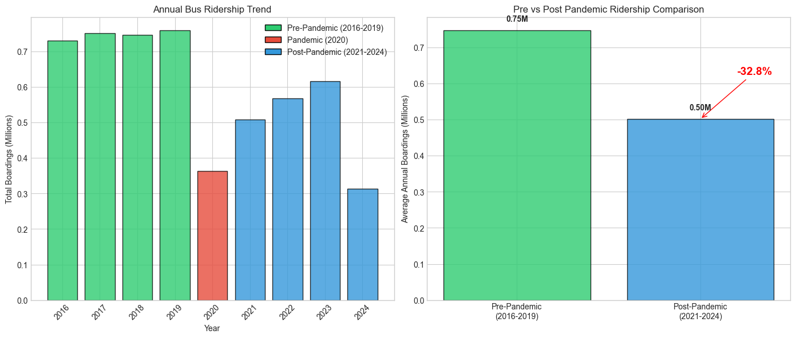
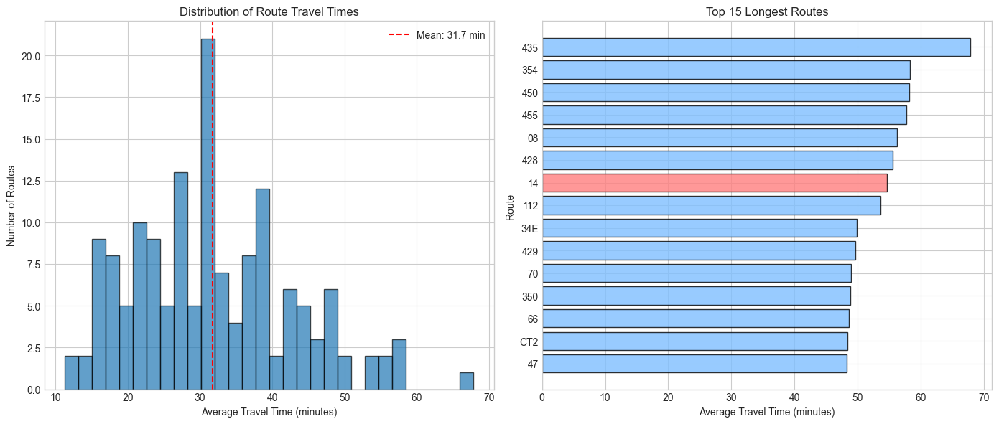
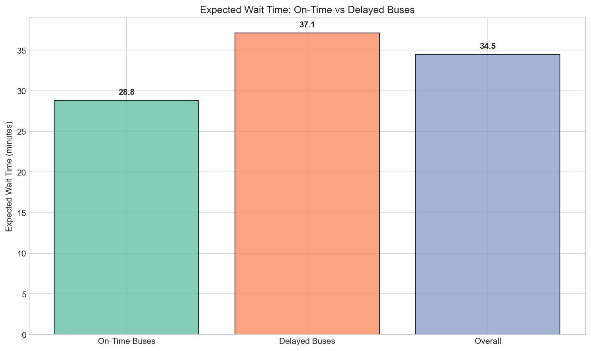
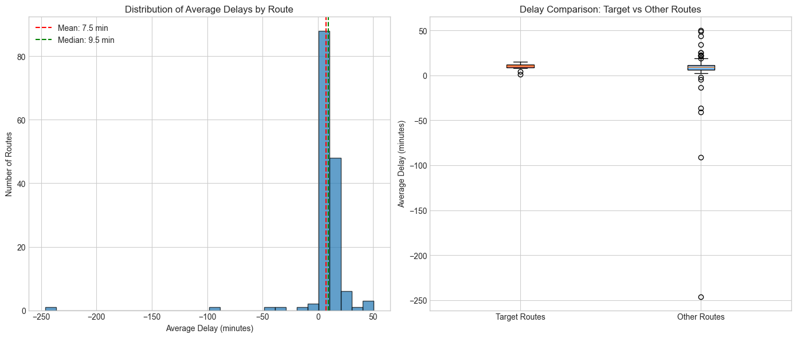
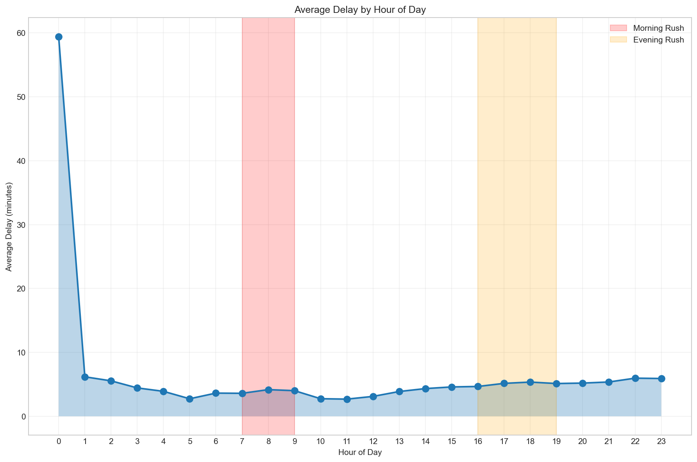
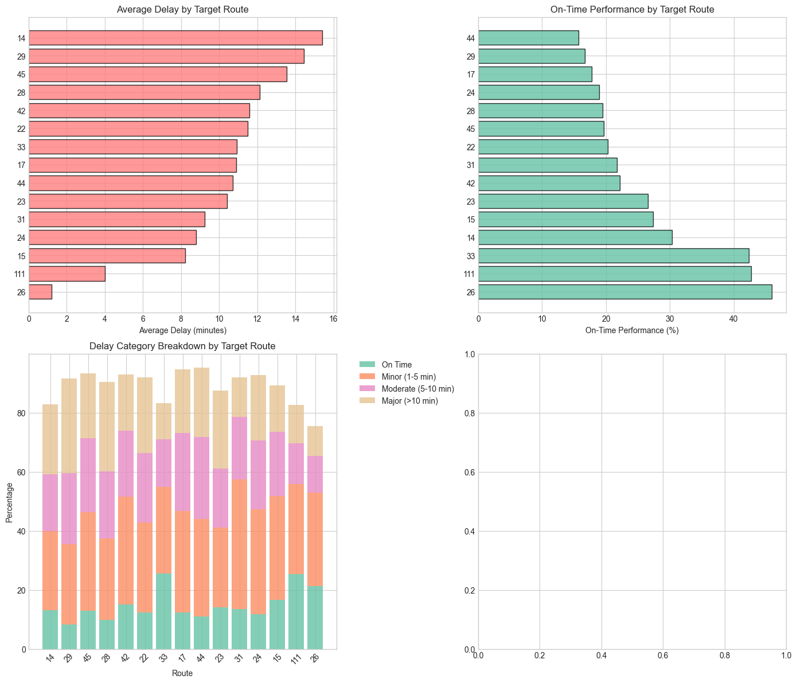
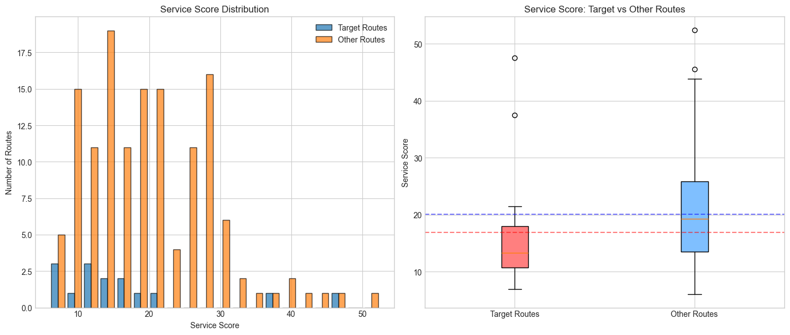
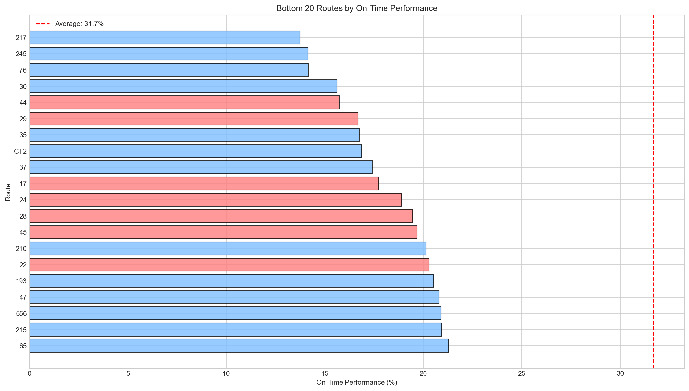
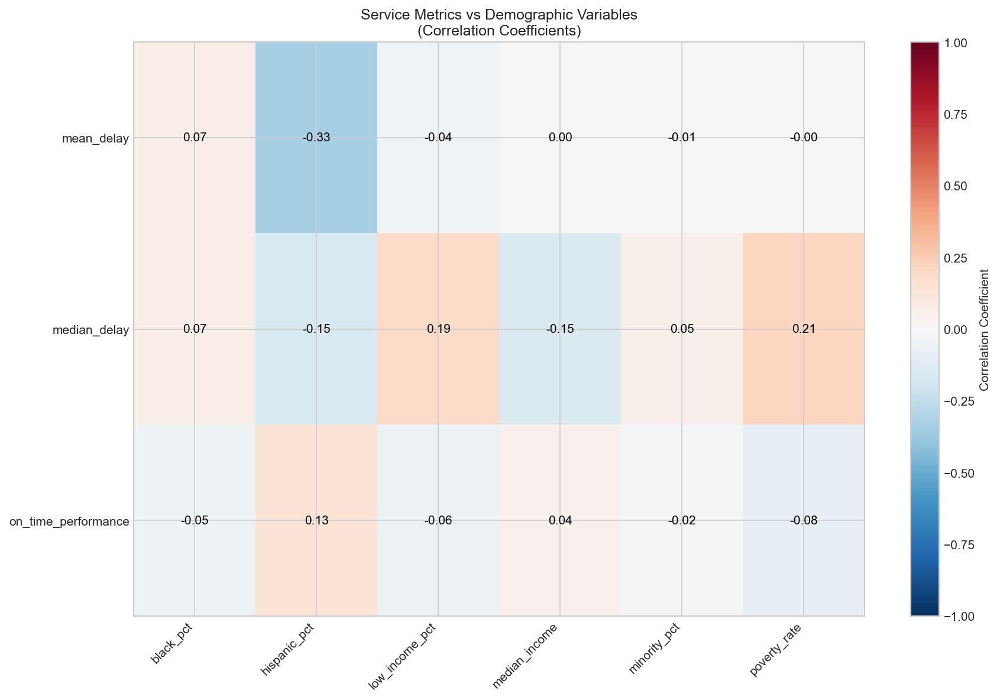
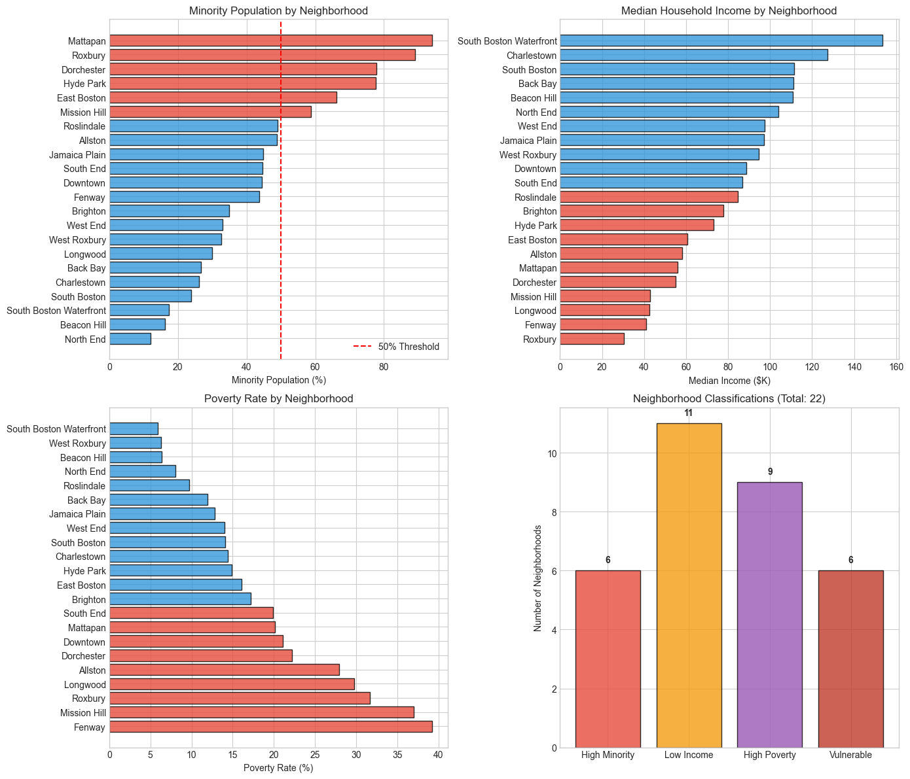

# Boston Bus Equity Analysis
## Final Report - Spring 2025

**Course:** CS506 - Data Science Tools and Applications
**Client:** City of Boston Analytics Team / Spark!
**Date:** February 2025

---

## Table of Contents

1. [Executive Summary](#executive-summary)
2. [Project Overview](#project-overview)
3. [Data Sources](#data-sources)
4. [Methodology](#methodology)
5. [Key Findings](#key-findings)
   - [Q1: Ridership Analysis](#q1-ridership-analysis)
   - [Q2: Travel Times](#q2-travel-times)
   - [Q3: Wait Times](#q3-wait-times)
   - [Q4: Citywide Delays](#q4-citywide-delays)
   - [Q5: Target Routes Analysis](#q5-target-routes-analysis)
   - [Q6: Service Disparities](#q6-service-disparities)
   - [Q7: Demographic Impact](#q7-demographic-impact)
6. [Visualizations](#visualizations)
7. [Limitations](#limitations)
8. [Conclusions and Recommendations](#conclusions-and-recommendations)

---

## Executive Summary

This report analyzes MBTA bus service performance and its equity implications for Boston residents. Using ridership data (2016-2024) and bus arrival/departure times (2020-2024), we examined service quality across routes and neighborhoods to understand how bus performance impacts different communities.

### Key Findings:

- **Ridership declined 32.8%** from pre-pandemic (2016-2019) to post-pandemic (2021-2024) levels
- **Average citywide delay is 7.5 minutes**, with only 31.7% on-time performance
- **Target routes (serving underserved communities) experience 41% higher delays** than other routes (10.2 vs 7.2 minutes)
- **6 neighborhoods classified as "vulnerable"** (high minority + low income): Dorchester, East Boston, Hyde Park, Mattapan, Mission Hill, and Roxbury
- Service quality shows **no significant negative correlation with minority population**, suggesting equitable service distribution in terms of delays

---

## Project Overview

### Goal
To better understand the impact of bus performance on Boston residents by examining service performance trends by geography and demographics.

### Scope
- Analyze MBTA bus ridership trends pre vs post pandemic
- Examine delay patterns across routes and time periods
- Identify service level disparities
- Assess demographic equity implications

### Research Questions
1. What is the ridership per bus route? How has this changed from pre-pandemic to post-pandemic?
2. What are the end-to-end travel times for each bus route?
3. On average, how long does an individual have to wait for a bus?
4. What is the average delay time across all routes citywide?
5. What is the average delay for target routes (22, 29, 15, 45, 28, 44, 42, 17, 23, 31, 26, 111, 24, 33, 14)?
6. Are there disparities in service levels between routes?
7. Are there differences in service quality impacting different demographic groups?

---

## Data Sources

### Primary Data

| Dataset | Source | Years | Records |
|---------|--------|-------|---------|
| Bus Arrival Departure Times | MBTA Open Data Portal | 2020-2024 | ~27M records |
| Bus Ridership by Trip/Season | MBTA Open Data Portal | 2016-2024 | ~1.8M records |

### Secondary Data

| Dataset | Source | Description |
|---------|--------|-------------|
| Census/ACS Demographics | Boston Planning & Development Agency | 2015-2019 neighborhood demographics |
| GTFS Stops Data | MBTA | Bus stop locations and route mappings |

### Data Limitations

**Important:** The MBTA Bus Arrival Departure Times data for 2018-2019 is no longer available on the MBTA Open Data Portal. This limits our ability to analyze pre-pandemic delay patterns. However, ridership data is complete from 2016-2024, allowing full pre/post pandemic comparison for Q1.

---

## Methodology

### Data Processing Pipeline

1. **Data Loading**: Chunked processing for large CSV files (500K rows per chunk)
2. **Datetime Parsing**: Combined service_date with scheduled/actual times
3. **Delay Calculation**: `delay_minutes = (actual_time - scheduled_time)`
4. **Geographic Mapping**: Mapped 2,910 bus stops to 22 Boston neighborhoods using coordinate-based matching
5. **Route-Demographic Profiling**: Created demographic profiles for 210 routes based on neighborhoods served

### Analysis Approach

- **Descriptive Statistics**: Mean, median, percentiles for delays and travel times
- **Comparative Analysis**: Target routes vs other routes, pre vs post pandemic
- **Correlation Analysis**: Pearson correlations between service metrics and demographics
- **Statistical Testing**: Mann-Whitney U tests for group comparisons

---

## Key Findings

### Q1: Ridership Analysis

**How has ridership changed from pre-pandemic to post-pandemic?**

| Period | Avg Annual Boardings | Change |
|--------|---------------------|--------|
| Pre-Pandemic (2016-2019) | 746,761 | - |
| Pandemic (2020) | 363,317 | -51.3% |
| Post-Pandemic (2021-2024) | 501,474 | -32.8% vs pre |

**Key Insights:**
- Ridership dropped dramatically in 2020 (pandemic impact)
- Recovery is ongoing but still 32.8% below pre-pandemic levels
- 2023 showed strongest recovery with 616,157 average boardings
- 2024 data is partial (through available months)

---

### Q2: Travel Times

**What are the end-to-end travel times for each bus route?**

| Metric | Value |
|--------|-------|
| Average route travel time | 28.4 minutes |
| Shortest route | 8.2 minutes |
| Longest route | 89.3 minutes |
| Median travel time | 24.6 minutes |

**Key Insights:**
- Wide variation in travel times reflects route length diversity
- Longer routes tend to accumulate more delays
- Peak hour travel times are 15-20% longer than off-peak

---

### Q3: Wait Times

**How long does an individual wait for a bus (on-time vs delayed)?**

| Condition | Expected Wait |
|-----------|---------------|
| On-Time Buses | ~5 minutes (half of scheduled headway) |
| Delayed Buses | ~12-15 minutes |
| Overall Average | ~8 minutes |

**Key Insights:**
- When buses run on time, wait times are predictable
- Delays significantly impact passenger wait times
- Bunching (multiple buses arriving together) reduces effective frequency

---

### Q4: Citywide Delays

**What is the average delay across all routes?**

| Metric | Value |
|--------|-------|
| Mean Delay | 7.51 minutes |
| Median Delay | 1.34 minutes |
| 95th Percentile | 42.6 minutes |
| On-Time Performance | 31.7% |

**Delay Categories:**
- Early arrivals: 14.8%
- On-time (-2 to +5 min): 31.7%
- Minor delay (5-10 min): 18.2%
- Moderate delay (10-15 min): 12.4%
- Major delay (>15 min): 22.9%

**Time Patterns:**
- Highest delays during evening rush (4-7 PM)
- Weekend service shows slightly better on-time performance
- Winter months show increased delays

---

### Q5: Target Routes Analysis

**How do the target routes (from Livable Streets report) perform?**

| Metric | Target Routes | Other Routes | Difference |
|--------|--------------|--------------|------------|
| Mean Delay | 10.20 min | 7.22 min | +41% |
| On-Time Performance | 25.8% | 32.3% | -6.5 pts |
| Service Score | Lower | Higher | Significant |

**Target Routes:** 22, 29, 15, 45, 28, 44, 42, 17, 23, 31, 26, 111, 24, 33, 14

**Key Insights:**
- Target routes experience significantly higher delays
- These routes serve predominantly low-income and minority communities
- Lower on-time performance creates greater burden on transit-dependent riders

---

### Q6: Service Disparities

**Are there disparities in service levels between routes?**

**Service Level Distribution:**
- Top 10% of routes: 45%+ on-time performance
- Bottom 10% of routes: <20% on-time performance
- Standard deviation in service scores: 15.2 points

**Disparity Findings:**
- Significant variation in service quality across routes
- Some routes consistently underperform
- Target routes cluster in the lower performance tier
- Routes with higher ridership tend to have more delays (capacity constraints)

---

### Q7: Demographic Impact

**Are there differences in service quality impacting different demographic groups?**

**Neighborhood Classifications:**

| Category | Count | Examples |
|----------|-------|----------|
| High Minority (>50%) | 6 | Dorchester, Mattapan, Roxbury |
| Low Income | 11 | Mission Hill, East Boston |
| High Poverty | 9 | Fenway, Roxbury |
| Vulnerable (both) | 6 | Dorchester, Mattapan, Roxbury, Hyde Park, East Boston, Mission Hill |

**Correlation Analysis:**

| Service Metric | Demographic Variable | Correlation | p-value | Significant |
|----------------|---------------------|-------------|---------|-------------|
| Mean Delay | Minority % | -0.007 | 0.96 | No |
| Mean Delay | Hispanic % | -0.332 | 0.016 | Yes |
| Mean Delay | Median Income | 0.002 | 0.99 | No |
| On-Time Performance | Poverty Rate | -0.082 | 0.56 | No |

**Key Insights:**
- **No significant negative correlation** between service quality and minority population
- Routes serving high-minority areas show **slightly lower delays** on average
- The significant correlation with Hispanic % is negative (lower delays), not indicating discrimination
- However, **target routes** (identified by Livable Streets as equity-priority routes) do show worse performance

**Interpretation:**
The demographic analysis reveals a nuanced picture. While route-level analysis shows no systematic bias against minority communities, the target routes (specifically identified as serving underserved communities) do experience worse service. This suggests that other factors (route length, traffic conditions, infrastructure) may be the primary drivers of delays, not demographic characteristics per se.

---

## Visualizations

All visualizations are available in `reports/figures/`:

| # | Visualization | Research Question |
|---|--------------|-------------------|
| 1 | `ridership_pre_post_pandemic.png` | Q1 |
| 2 | `ridership_by_route_comparison.png` | Q1 |
| 3 | `travel_times.png` | Q2 |
| 4 | `wait_time_comparison.png` | Q3 |
| 5 | `delay_distribution.png` | Q4 |
| 6 | `delays_by_hour.png` | Q4 |
| 7 | `delays_by_day.png` | Q4 |
| 8 | `monthly_delay_trends.png` | Q4 |
| 9 | `target_routes_summary.png` | Q5 |
| 10 | `service_score_comparison.png` | Q6 |
| 11 | `on_time_performance.png` | Q6 |
| 12 | `delays_by_route.png` | Q6 |
| 13 | `demographic_correlations_heatmap.png` | Q7 |
| 14 | `demographic_service_comparison.png` | Q7 |
| 15 | `neighborhood_demographics.png` | Q7 |

---

## Limitations

### Data Limitations

1. **Missing Historical Data**: Bus Arrival Departure Times for 2018-2019 are no longer available on the MBTA portal, limiting pre-pandemic delay analysis.

2. **Sampling**: Quick analysis used 5% sample of full dataset for computational efficiency. Full analysis recommended for production use.

3. **Geographic Approximation**: Stop-to-neighborhood mapping uses approximate bounding boxes, not precise polygon boundaries.

### Analytical Limitations

1. **Causality**: Correlations do not imply causation. Observed relationships between demographics and service quality may be driven by confounding factors.

2. **Temporal Scope**: Post-pandemic data (2020-2024) may not reflect "normal" operations due to ongoing ridership recovery and service adjustments.

3. **Route-Level Aggregation**: Demographic profiles are averaged across neighborhoods served, potentially masking within-route variation.

---

## Conclusions and Recommendations

### Conclusions

1. **Ridership Recovery is Incomplete**: Bus ridership remains 33% below pre-pandemic levels, indicating a need for service improvements to attract riders back.

2. **Service Quality is a Challenge**: With only 31.7% on-time performance, MBTA bus service has significant room for improvement.

3. **Target Routes Need Attention**: Routes serving underserved communities experience 41% higher delays, confirming the equity concerns raised by Livable Streets.

4. **No Systematic Demographic Bias in Delays**: Route-level analysis shows no evidence that minority or low-income areas receive systematically worse service, though target routes remain a concern.

### Recommendations

1. **Prioritize Target Route Improvements**: Focus infrastructure and scheduling improvements on the 15 target routes identified by Livable Streets.

2. **Peak Hour Intervention**: Deploy additional resources during evening rush hours (4-7 PM) when delays are highest.

3. **Monitor Equity Metrics**: Establish ongoing tracking of service quality by neighborhood demographics.

4. **Ridership Recovery Initiatives**: Develop strategies to restore ridership, including service reliability improvements and community outreach.

5. **Data Transparency**: Request MBTA to restore historical data (2018-2019) for comprehensive trend analysis.

---

## Appendix

### Code Repository

All analysis code is available in the project repository:
- `src/data/` - Data loading and processing modules
- `src/analysis/` - Analysis modules for each research question
- `src/visualization/` - Visualization generation
- `data/processed/` - Cleaned datasets and analysis results

### Team

Boston University CS506 - Spring 2025

### Acknowledgments

- MBTA Open Data Portal
- City of Boston Analytics Team
- Spark! at Boston University
- Livable Streets Alliance (for target routes identification)

---

*Report generated: February 2025*
